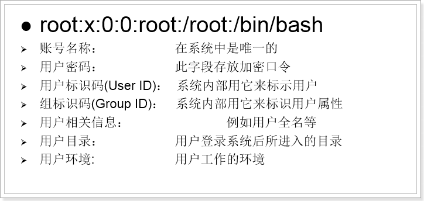
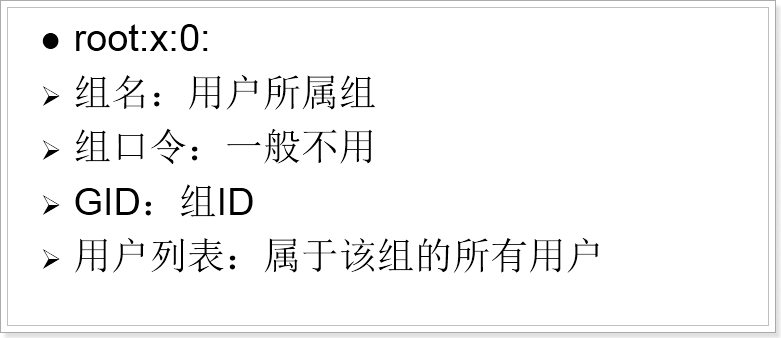
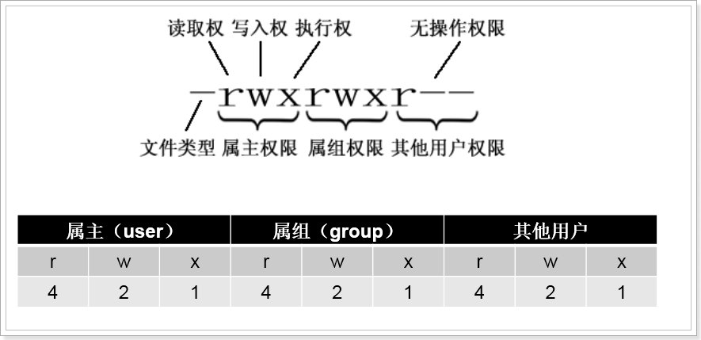

## 目录
- [Linus目录结构](#1)
- [目录操作命令](#2)
- [文件操作命令](#3)
- [打包和解压命令](#4)
- [查看文件内容](#5)
- [编辑文本内容](#6)
- [组合命令](#7)
- [网络相关命令](#8)
- [下载与安装](#9)
- [系统相关](#10)
- [用户及组管理](#11)
- [权限管理](#12)
- [软件的安装卸载与配置](#13)

## Linus目录结构
- / 根目录
- /bin 　　一般用户可用,二进制可执行命令,主要有cat,chmod, chown, date, mv, mkdir, cp, bash等等常用的指令
- /boot 　　核心档案
	- grub 　　开关机设定档案
- /dev　　 任何装置与周边设备都是以档案的型态存在于这个目录当中
- /etc 　　软件与系统的设定档案,配置文件,可以让一般使用者查询
	- /etc/init.d 　　各种软件的启动脚本
	- /etc/xinetd.d　　这就是所谓的super daemon管理的各项服务的设定档目录
	- /etc/X11/　　与X Window有关的各种设定档都在这里，尤其是xorg.conf或XF86Config这两个X Server的设定档。
- /home 　　除root外所有用户都有一个目录在这儿,可以用~user表示
- /lib 　　标准程序设计库，又叫动态链接共享库，作用类似windows里的.dll文件
	- /lib/modules 　　各种不同版本核心的模组
- /media 　　暂存媒体,包括软碟、光碟、DVD等等装置都暂时挂载于此
- /mnt 　　同/media
- /opt 　　第三方软件
- /proc 　　这个目录本身是一个虚拟文件系统(virtual filesystem)喔。 他放置的资料都是在内存当中，例如系统核心、行程资讯(process)（是进程吗?）、周边装置的状态及网络状态等等。
- /root 　　系统管理员的主目录
- /sbin 　　超级管理命令，这里存放的是系统管理员使用的管理程序,包括：fdisk, fsck, ifconfig, init, mkfs等等。
- /srv 　　service的缩写,是一些网路服务启动之后，这些服务所需要取用的资料目录。
- /sys 　　这个目录其实跟/proc非常类似，也是一个虚拟的档案系统，主要也是记录与核心相关的资讯。
- /tmp 　　公共的临时文件存储点
- /var 　　某些大文件的溢出区，比方说各种服务的日志文件
- /usr 　　最庞大的目录，要用到的应用程序和文件几乎都在这个目录
	- /usr/x11R6 　　存放x window的目录
	- /usr/bin 　　众多的应用程序
	- /usr/sbin 　　超级用户的一些管理程序
	- /usr/doc 　　linux文档
	- /usr/include 　　linux下开发和编译应用程序所需要的头文件
	- /usr/lib 　　常用的动态链接库和软件包的配置文件
	- /usr/man 　　帮助文档
	- /usr/src 　　源代码，linux内核的源代码就放在/usr/src/linux里
	- /user/local　　一般操作都在zheer
	- /usr/local/bin 　　本地增加的命令
	- /usr/local/lib 　　本地增加的库根文件系统
- /lost+found 　　这个目录是使用标准的ext2/ext3档案系统格式才会产生的一个目录，目的在于当档案系统发生错误时，将一些遗失的片段放置到这个目录下。

## Linux命令，其实就是Shell命令，是学好Linux的关键。

> 注意：  
> 　　1. 通过上下方向键来调取过往执行过的命令.  
> 　　2. 命令或参数仅需输入前几位就可以用tab键补全。

### 目录操作命令
- pwd 　　查看当前所在的路径
- cd 　　切换目录
- ls 　　查看目录下内容
	- ls -a 　　查看全部内容
	- ls -lh 　　显示详细信息
- mkdir 　　创建目录
	- mkdir -p [多级目录] 创建多级目录

### 文件操作命令
- touch 文件名 创建文件
- rm 删除文件或目录
	- rm 文件名 　　删除一个文件
	- rm -f 文件名 　　强制删除文件
	- rm -r 目录 　　递归删除一个目录及其中的内容
	- rm -rf * 　　清空当前目录
- cp 复制文件或目录
	- cp 1.txt 2.txt 　　复制1.txt到当前目录下,并命名为2.txt
	- cp 1.txt /tmp 　　复制1.txt到/tmp目录下
	- 目的地是文件则复制后重命名,目的地是目录,则直接复制
	- 复制的是目录的时候,需要加-r参数
- mv 剪切
	- mv 1.txt 2.txt 　　把1.txt重命名为2.txt
	- mv 1.txt /tmp 　　把1.txt剪切到/tmp下
	- 目的地是文件则剪切后重命名,目的地是目录,则直接剪切
	- 剪切的是目录的时候,不需要参数

### 打包和解压命令
- tar 打包或解压
	- -z 使用gzip压缩
	- -v 显示运行过程信息
	- -f 指定操作的文件或目录名
	- -c compress 创建新的tar文件
	- -x extract 解开tar文件
	- tar -zcvf 压缩后文件名.tar.gz 目标文件　　打包并压缩目标文件
	- tar -zxvf 要解压的文件名　　解压缩到当前目录
	- tar -zxvf 要解压的文件名 -C 目标目录　　解压到目标目录,注意,C大写

### 查看文件内容
- cat 文件名 　　将文件内容输出到控制台
- more 文件名 　　文件内容过多时使用,空格显示下一页数据,回车显示下一行,不可以回退看数据,按q键退出
- less 文件名 　　文件内容过多时使用, 使用上下键翻页与回退
- **tail 文件名 查看文件最后部分内容**
	- tail -10 文件名 　　查看最后10行内容
	- tail -f 文件名 　　动态显示文件最后内容
	- tail -100f 文件名 　　动态显示文件最后100行内容
- **grep 文件名 在文件中查找指定内容**
	- grep error catalina.log 　　在catalina.log日志中查找包含error的内容
	- grep error catalina.log --color 　　查找error并高亮显示
	- grep error catalina.log -- color -B5 -A5 　　查找内容,高亮显示,并显示内容前后个5行信息

### 编辑文本内容:vi/vim编辑器
> 　　vi既可以查看文件也可以编辑文件  
> 　　vim是vi的升级版本，具备更多的功能  
> 　　vi如果目标文件不存在，会创建新的文件。但是如果新文件没做编辑，退出后还会消失  
> 　　vi/vim的三种模式:  
> 　　编辑模式：对文本进行输入和修改  
> 　　底行模式：退出vim或者查找、替换功能  
> 　　命令模式：通过快捷命令操作数据，打开vi/vim默认就是命令模式  

-  三种模式的切换:
	-  命令模式切换到编辑模式:按a或o或i键
		- i　　光标不动
		- o　　另起一行
		- a　　光标到下一个字符
	-  编辑模式切换到命令模式:按ESC键
	-  命令模式切换到底行模式:按:或/键
	-  底行模式切换到命令模式:输入命令按回车后显示效果并回到命令模式
- 底行模式命令
	- 退出vi/vim
		- :q 　　未编辑时退出vim
		- :q! 　　编辑后，退出并且不保存
		- :wq 　　编辑后，退出且保存
	- 设置行号
		- :set nu 　　显示行号
		- :set nonu 　　不显示行号
	- 替换文本
		- :s/old/new/ 　　用new替换old，替换当前行的第一个匹配
		- :s/old/new/g 　　用new替换old，替换当前行的所有匹配
		- :%s/old/new/ 　　用new替换old，替换所有行的第一个匹配
		- :%s/old/new/g 　　用new替换old，替换整个文件的所有匹配
	- 查找
		- /文本 　　搜索指定文本，高亮显示，按n显示下一个，按N显示前一个
		- :整数 　　快捷跳转到指定行
- 命令模式命令
	- dd 　　剪切当前行
	- 5dd　　 剪切光标及下面共5行
	- yy 　　复制光标所在行
	- 5yy 　　复制光标及下面共5行
	- p 　　将之前dd或yy的数据粘贴到光标位置
	- R	　　进入替换模式，输入的任何数据都直接替换光标所在位置数据
- echo 内容 > 文件/路径

### 组合命令
- &gt; 　　重定向输出
	- cat /etc/1.txt > 2.txt 　　将输出重定向到2.txt中,会清空2.txt中原本的内容
- &gt;&gt; 追加重定向输出
	- cat /etc/1.txt >> 2.txt 　　将输出重定向到2.txt中,会在2.txt中原本的内容后添加1.txt的内容
- **管道 |**
	- 管道的作用是将一个命令的输出作为另一个命令的输入
	- ls --help | more 　　分页查询帮助信息
	- **ps -ef | grep java 　　查询名称中包含java的进程**
- 逻辑控制&&
	- 只有在&&左边的命令运行成功时,&&右边的命令才会被执行
	- cp 1.txt 2.txt && cat 2.txt
	- **./startup.sh && tail -50f ../logs/catalina.out**
		- ./startup.sh 执行当前目录下的start.sh
		- tail -50f ../logs/catalina.out 动态查看catalina.out中末尾50行的内容
		- 总结:将tomcat启动时的日志信息输出到控制台

### 网络相关命令
- 基本命令
	- ifconfig 　　 显示或设置网络设备。
	- 设置网卡状态：
		- ifconfig eth0 up　　 启用eth0网卡
		- ifconfig eth0 down  　　停用eth0网卡
	- 简写格式：
		- ifup eth0 　　启用eth0网卡
		- ifdown eth0 　　停用eth0网卡
	- ping   探测网络是否通畅。
		- ping 192.168.56.1
	- netstat 查看网络端口。
		- netstat -an | grep 3306 　　查询3306端口占用情况
	- 重启网络服务
		- service network restart
- 修改主机名称
	- setup 主机名称
	- vi /etc/sysconfig/network
- 修改网卡信息
	- 配置网卡信息的文件：
		- /etc/sysconfig/network-script/ifcfg-eth0
		- eth0为网卡名称
- **修改防火墙配置**
	- chkconfig iptables on 　　永久性开启防火墙,重启生效
	- chkconfig iptables off　　 永久性开启防火墙,重启生效
	- service iptables start 　　马上生效,重启复原
	- service iptables stop 　　马上生效,重启复原
	- 打开防火墙指定端口（推荐）：
		- /sbin/iptables -I INPUT -p tcp --dport 3306 -j ACCEPT 　　防火墙打开3306端口
		- /etc/rc.d/init.d/iptables save 　　保存修改
		- /etc/init.d/iptables status 　　查看状态

### 下载与安装
- wget url地址
	- wget -r -p http://www.linuxprobe.com 　　递归下载指定网站的所有数据到当前目录
- ymp

### 系统相关
- date  　　显示或设置系统时间
	- date  　　显示当前系统时间
	- date -s "2014-01-01 10:10:10" 　　设置系统时间
- df 显示磁盘信息
	- df –h  　　友好显示大小
- free 显示内存状态
	- free –m 　　以mb单位显示内存状态
- who 　　显示目前登入系统的用户信息。
- hostname 　　查看当前主机名
	- 修改：vi /etc/sysconfig/network
- uname 　　显示系统信息。
	- uname –a 　　显示本机详细信息。
	- 依次为：内核名称(类别)，主机名，内核版本号，内核版本，内核编译日期，硬件名，处理器类型，硬件平台类型，操作系统名称
- **系统运行状态**
	- **top 用于动态的监视进程活动与系统负载等信息,强化版的Windows任务管理器**  
第一行(top)：
　　“15:16:11”为系统当前时刻;       
　　“6:22”为系统启动后到现在的运作时间;  
　　“2 users”为当前登录到系统的用户，更确切的说是登录到用户的终端数 -- 同一个用户同一时间对系统多个终端的连接将被视为多个用户连接到系统，这里的用户数也将表现为终端的数目;  
　　“load average”为当前系统负载的平均值，后面的三个值分别为1分钟前、5分钟前、15分钟前进程的平均数，一般的可以认为这个数值超过 CPU 数目时，CPU 将比较吃力的负载当前系统所包含的进程;  
第二行(Tasks)：  
　　“131 total”为当前系统进程总数;  
　　“1 running”为当前运行中的进程数;  
　　“130 sleeping”为当前处于等待状态中的进程数;  
　　“0 stoped”为被停止的系统进程数;  
　　“0 zombie”未被复原的进程数（僵尸进程）;  
第三行(Cpus)：  
分别表示了 CPU 当前的使用率;  
　　“0.1% us”：用户进程占用CPU百分比  
　　“0.1% sy”：内核进程占用CPU百分比    
　　“0.1% ni”：用户进程空间内改变过优先级的进程占用CPU百分比    
　　“99.7% id”：空闲CPU百分比  
　　“0.0% wa”：等待输入输出的CPU时间百分比  
　　“0.0% hi”：硬件中断请求时间     
　　“0.0% si”：软终端请求时间  
第四行(Mem)：  
　　分别表示了内存总量、当前使用量、空闲内存量、以及缓冲使用中的内存量;  
第五行(Swap)：  
　　表示类别同第四行(Mem)，但此处反映着交换分区(Swap)的使用情况。通常，交换分区(Swap)被频繁使用的情况，将被视作物理内存不足而造成的。  
列表部分：  
　　PID：进程id  
　　USER；进程所有者的用户名  
　　PR：进程的优先级   
　　NI：nice值。负值表示高优先级，正值表示低优先级  
　　VIRT -- 进程使用的虚拟内存总量，单位kb。VIRT=SWAP+RES  
　　RES -- 进程使用的、未被换出的物理内存大小，单位kb。RES=CODE+DATA  
　　SHR -- 共享内存大小，单位kb  
　　S -- 进程状态。  
　　D =不可中断的睡眠状态  
　　R =运行  
　　S =睡眠  
　　T =跟踪/停止  
　　Z =僵尸进程   
%CPU　　上次更新到现在的CPU时间占用百分比   
%MEM　　进程使用的物理内存 百分比  
TIME+　　进程使用的CPU时间总计，单位1/100秒  
COMMAND　　启动任务的命令行（包括参数）  

- **系统进程管理**
	- ps 正在运行的某个进程的状态
		- ps –ef  查看所有进程
		- ps –ef | grep ssh 查找某一进程
		- ps aux命令可以查看更详细的进程信息！
	- kill 杀掉某一进程
		- kill 2868  杀掉2868编号的进程
		- kill -9 2868  强制杀死进程
- 系统状态管理
	- 关机命令
		- shutdown -h now  （立刻关机）
		- shutdown -h 5  （5分钟后关机）
		- poweroff  （立刻关机）
		- halt （立刻关机）
	- 重启命令
		- shutdown -r now (立刻重启)
		- shutdown -r 5 (5分钟重启)
		- reboot （立刻重启）
- 关闭与开启服务
	- service 服务名 start
	- service 服务名 stop
	- service 服务名 restart

### 用户及组管理
- useradd 用户名 添加一个用户
	- useradd test 添加test用户
	- useradd test -d /home/test1 指定用户home目录
- passwd 用户名 密码
	- passwd test 123	为test用户设置密码
- su 切换用户
	- su - test 切换到用户u1,环境也切换
	- exit 退出su的用户切换
- userdel散出用户
	- userdel -r test 删除用户及home中的目录
- id 查看当前用户
- id 用户名 查看指定用户
- sudo 命令
	- 可以让普通用户使用其他用户的权限来执行一些命令
	- 记录用户使用过的命令
	- 配置文件/etc/sudoers集中管理用户权限
	- 每5分钟验证一次密码
- 给用户添加sudo权限,输入visudo命令打开/etc/sudoers修改
	- 修改sudoers文件	TODO
- groupadd 创建组
	- groupadd public 创建一个名为public的组
	- useradd u1 -g public 创建u1用户并添加到组public 
- usermod -g guest u1 把u1用户移动到guest组,并移除原来的组
- usermod -G guest u1 把u1用户移动到guest组,保留在原来的组
-groupdel 删除组
	- 如果组中有成员,必须删除成员才能删除组
	- groupdel public 删除public组
- 用户,密码,组在Linux中的位置:
	- /etc/password 用户文件
	- <!--这儿必须要用绝对路径,如果用相对路径,则上传的时候图片丢失-->
	- 
	- /etc/shadow 密码文件
	- 
	- 
	- /etc/group 组文件
	- 
	- 

### 权限管理
- 当使用ll命令查看文件详细信息时,最前面有权限信息
	- 
	- 
	- 第一个位置是文件类型
		- - 普通文件
		- d 目录
		- | 符号链接
		- c 字符设备文件
		- s 块设备文件
		- s 套接字
		- p 命名管道
	- 创建软连接的方式：
		- ln -s 源文件地址 联接地址
	- 权限分段，每一段代表不同的用户：
		- 属主权限：当前文件所属用户的权限，在Linux中每一个文件都有所属的用户
		- 属组权限：当前文件的用户所在组的其它成员的权限
		- 其它用户权限：跟文件所属用户不在同组的其它用户的权限
	- 每一段中的内容都是一样的，分别限定：读（r=4）、写（w=2）、执行（x=1）
		- rwx		7		具备所有权限
		- rw-		6		具备读写权限
		- r-x		5		具备读和执行权限
		- r--		4		具备只读权限
		- -wx		3		具备写和执行权限
		- -w-		2		具备写权限
		- --x		1		具备执行权限

- chmod 修改文件权限
	- chmod 755 a.txt
	- chmod u=rwx,g=rx,o=rx a.txt
	- 上面两种方式等效
	- 可以在创建文件/目录时指定权限
		- mkdir -m777 目录/文件名
- chown 修改目录/文件所属用户及组
	- chown 新用户名:新用户组 被修改的文件或目录
	- chown user1:guest a.txt 变更文件a.txt到user1用户和guest组
	- chown -R user1:guest abc 变更目录及其子内容到user1用户和guest组

### 软件的安装卸载与配置
- rpm -qa | grep 关键字 查询含有关键字的已安装软件  
- rpm -e --nodeps 软件完整名称 删除软件  
- tar -zxvf 安装tar.gz文件
	- tar –zxvf jdk-7u71-linux-x64.tar.gz 
- rpm -ivh 文件名 --nodeps --force	安装rpm文件  
- vi /etc/profile	在这个文件里添加环境变量
	- 如:java应添加
	- export JAVA_HOME=/usr/java/jdk1.7.0_71
	- export PATH=$PATH:$JAVA_HOME/bin
	- export CLASSPATH=.:$JAVA_HOME/lib/dt.jar:$JAVA_HOME/lib/tools.jar
	- export JAVA_HOME PATH CLASSPATH
- source /etc/profile 重新编译环境变量文件,每次修改环境变量文件都要重新编译
- 运行软件
	- ./startup.sh 在当前目录运行
	- sh 命令文件

