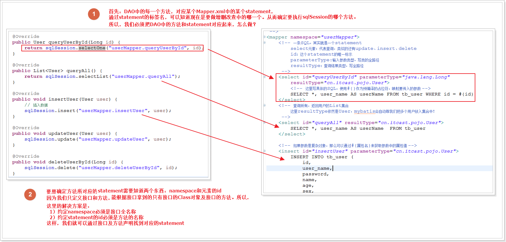
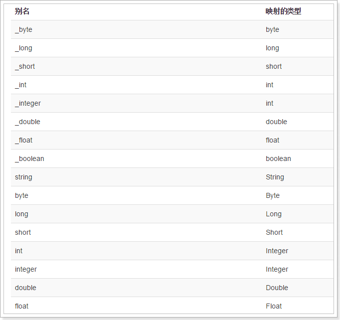
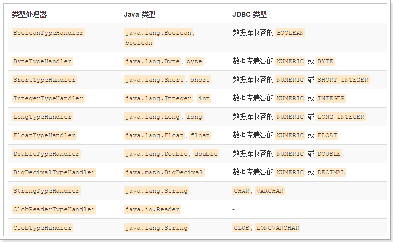
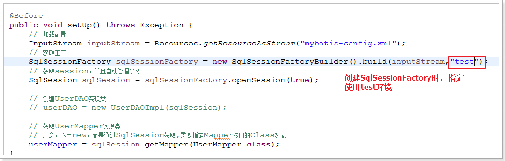
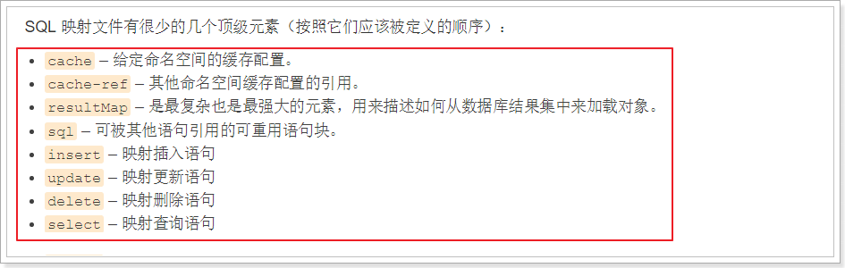
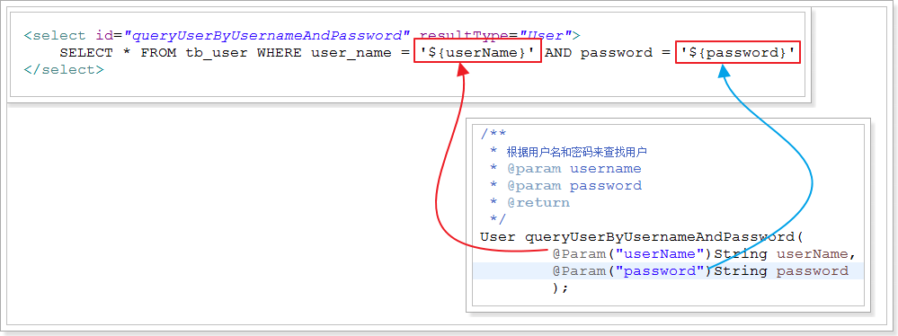
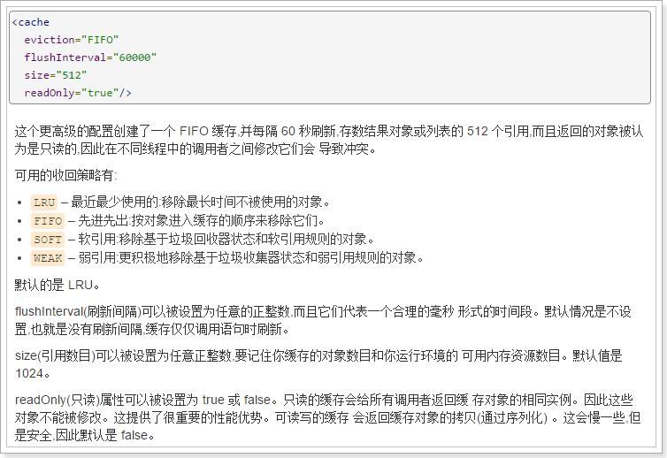
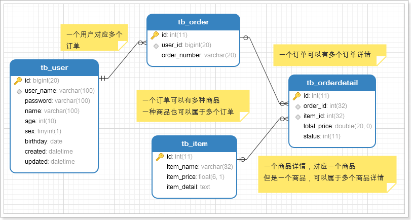

## 目录
- [1. Mybatis特点](#1)
- [2. MyBatis架构/执行流程/入门案例](#2)
    - [2-1. MyBatis执行流程](#2-1)
    - [2.2 mybatis-config.xml](#2-2)
    - [2.3 XxxMapper.xml](#2-3)
    - [2.4 接口UserMapper](#2-4)
    - [2.5 测试UserMapperTest](#2-5)
    - [2.6 自己写Dao实现类](#2-6)
- [3. mybatis-config 全局配置详解](#3)
- [4. Mapper.xml映射文件详解](#4)
- [5. #{}与${}区别与联系](#5)
- [6. 缓存](#6)
- [7. 动态SQL](#7)
- [8. 高级查询](#8)
- [9. 延迟加载](#9)

### 1. Mybatis特点
- 支持自定义SQL、存储过程、及高级映射
- 实现自动对SQL的参数设置
- 实现自动对结果集进行解析和封装
- 通过XML或者注解进行配置和映射
- 实现Java对象与数据库表的映射转换

### 2. MyBatis架构/执行流程/入门案例
- **MyBatis架构**
- 配置文件：
    - `mybatis-condig.xml`, 是MyBatis的全局配置文件,包含全局配置信息,如数据库连接参数,插件等.整个框架中只需要一个即可.
    - `XxxMapper.xml`,是映射文件,里面配置要执行的SQL语句,每个SQL对应一个Statement,可以有多个XxxMapper.xml文件
- Mybatis会通过SqlSessionFactoryBuilder来加载配置文件，生成一个SqlSessionFactory
    - 加载`mybatis-config.xml`和`XxxMapper.xml`
    - 加载`XxxMapper.xml`的时候，顺便会对Sql进行编译，形成statement
- 通过SqlSessionFactory建立连接，获取SqlSession对象
- MyBatis获取要执行的statement，进行自动参数设置
- SqlSession底层会通过Executor（执行器）来执行编译好的Statement，获取结果
- SQL的输入参数类型：
    - POJO，普通Java对象
    - HashMap，其实是POJO的Map形式， 键值对就是对象字段名和值z``
    - 各种基本数据类型
- 查询结果的输出形式
    - POJO，普通Java对象
    - HashMap，其实是POJO的Map形式， 键值对就是对象字段名和值
    - 各种基本数据类型

#### 2-1. MyBatis执行流程
- 编写配置文件（全局配置文件mybatis-config.xml和所有的mapper.xml映射文件）
    - 简单来说：就是准备JDBC连接参数以及要用到的Sql语句
- 加载配置，创建SqlSessionFactory
    - 这里获取连接参数，获取Sql，对Sql进行预编译，形成statement
- 通过SqlSessionFactory创建SqlSession
    - 这里就是调用了连接参数，连接数据库，形成会话
- 通过SqlSession执行statement，实现CRUD
    - 给前面编译好的statement设置Sql参数，然后执行
- 通过SqlSession提交事务
- 通过SqlSession关闭会话
- **注意事项**
    - 每个dao接口对应一个`XxxMapper.xml`文件,命名为XxxMapper是一种规范,并不是强制
    - `XxxMapper.xml`的namespace必须是接口的全类名
    - `XxxMapper.xml`中的每个statement的id必须是接口中对应的方法名
    - statement中定义的resultType必须和接口中对应方法的返回值一致

#### 2-2. mybatis-config.xml

    <configuration>
        <!--加载外部配置属性,写有驱动,url,用户名,密码-->
        <properties resource="jdbc.properties"/>
        <!--运行环境,可以配置多个,default指向的是一个叫development的环境-->
        <environments default="development">
            <!--环境参数,id:环境的唯一标识符-->
            <environment id="development">
                <transactionManager type="JDBC"/>
                <dataSource type="POOLED">
                    <!--从jdbc.properties中取值-->
                    <property name="driver" value="${jdbc.mysql.driver}"/>
                    <property name="url" value="${jdbc.mysql.url}"/>
                    <property name="username" value="${jdbc.mysql.username}"/>
                    <property name="password" value="${jdbc.mysql.password}"/>
                </dataSource>
            </environment>
        </environments>
        <!--指定所有的Mapper映射文件-->
        <mappers>
            <!--resource:在项目的resource目录下寻找-->
            <mapper resource="XxxMapper.xml"/>
        </mappers>
    </configuration>

#### 2-3. XxxMapper.xml

    <!--
    定义所有要用到的sql语句和映射关系
    namespace:当前这个Mapper文件的唯一标识,不能与其他Mapper文件重复
    -->
    <mapper namespace="xl.idea.mybatis.mapper.UserMapper">
        <!--定义一条sql,其实就是一个statement-->
        <!--
            select:表示这是一条查询语句,还有insert,delect,update
            id:唯一标识
            parameterType:sql的实际参数类型,写全类名
            resultType:返回结果集的数据类型,写全类名
        -->
        <select id="queryUserById" parameterType="java.lang.Long" resultType="xl.idea.mybatis.pojo.User">
            <!--
                这里写具体的sql语句,使用#{}作为参数的占位符,编译时,会替换为?然后注入真实参数
            -->
            SELECT *, user_name AS userName FROM tb_user WHERE id = #{id}
        </select>

        <!--
            查询全部用户,
            resultType:返回的结果虽然是一个List,这里依然写List中的元素类型,Mybatis会自动判断返回值个数并做封装
        -->
        <select id="queryAll" resultType="xl.idea.mybatis.pojo.User">
            SELECT *,user_name AS userName FROM tb_user
        </select>

        <!--添加用户信息-->
        <insert id="insertUser" parameterType="xl.idea.mybatis.pojo.User">
            <!-- 注意，这里用#{字段名}，mybatis会自动根据字段名，去User参数中找字段值，设置到Sql中 -->
            INSERT INTO  tb_user(
                id,
                user_name,
                password,
                name,
                age,
                sex,
                birthday,
                created,
                updated
            ) VALUES (
                NULL,
                #{userName},
                #{password},
                #{name},
                #{age},
                #{sex},
                #{birthday},
                NOW(),
                NOW()
            );
        </insert>

        <!--修改用户-->
        <update id="updateUser" parameterType="xl.idea.mybatis.pojo.User">
            UPDATE tb_user SET
                user_name = #{userName},
                password = #{password},
                name = #{name},
                age = #{age},
                sex = #{sex},
                birthday = #{birthday},
                updated = NOW()
            WHERE
                id = #{id};

        </update>

        <!--删除用户-->
        <delete id="deleteUserById" parameterType="java.lang.Long">
            DELETE from tb_user WHERE id = #{id}
        </delete>
    </mapper>

#### 2-4. 接口UserMapper

    public interface UserMapper {
        /**根据ID来查询用户*/
        User queryUserById(Long id);
        /**查询所有*/
        List<User> queryAll();
        /**添加用户*/
        void insertUser(User user);
        /**修改用户信息*/
        void updateUser(User user);
        /**根据ID删除用户*/
        void deleteUserById(Long id);
    }

#### 2-5. 测试UserMapperTest

    public class UserMapperTest {

        //使用sqlSeesion.getMapper获取到的dao的动态实现类
        private UserMapper userMapper;

        @Before
        public void setUp() throws Exception {
            // 设置资源路径
            String resource = "mybatis-config.xml";
            // 获取输入流，关联配置文件
            InputStream inputStream = Resources.getResourceAsStream(resource);
            // 读取配置，构建session工厂
            SqlSessionFactory sqlSessionFactory = new SqlSessionFactoryBuilder().build(inputStream);
            // 获取session,同时打开事务的自动提交，每一次操作都是个独立事务
            SqlSession sqlSession = sqlSessionFactory.openSession(true);

            /*动态实现代理dao,也就是说dao只需要写接口,不需要写实现类了
            * 要求:
            * 1.每个dao接口对应一个XxxMapper.xml文件
            * 2.XxxMapper.xml的namespace必须是接口的全类名
            * 3.XxxMapper.xml中的每个statement的id必须是接口中对应的方法名
            * 4.statement中定义的resultType必须和接口中对应方法的返回值一致
            * */
            this.userMapper = sqlSession.getMapper(UserMapper.class);
        }

        @Test
        public void testQueryUserById() {
            // 测试根据id查询
            User user = userMapper.queryUserById(1L);
            System.out.println(user);
        }

        //...其他方法
    }

#### 2-6. 自己写Dao实现类

### 3. mybatis-config 全局配置详解
**---------->这些配置在文件中的顺序很重要,必须严格按照以下顺序定义<--------------**  

- `properties`属性
    - 用于引用外部属性文件,如jdbc.properties
    - 使用${}来获取外部引用文件中的属性
- `settings`设置,会改变 MyBatis 的运行时行为
    - `cacheEnable` 所有映射器重配置的二级缓存的全局开关,默认true.
    - `lazyLoadingEnabled` 延迟加载开关,当开启时,所有关联对象都会延迟加载。特定关联关系中可通过设置`fetchType`属性来覆盖该项的开关状态。默认false.
    - `aggressiveLazyLoading` true启用时, 访问带有延迟加载属性的对象中一个懒加载对象属性时, 将完全加载这个对象的所有懒对象属性. 反之, 每种属性将会按需加载. 默认true.
    - `multipleResultSetsEnabled` 是否允许单一语句返回多结果集（需要兼容驱动）默认true
    - `useColumnLabel` 使用列标签代替列名。不同的驱动在这方面会有不同的表现，具体可参考相关驱动文档或通过测试这两种不同的模式来观察所用驱动的结果。默认true
    - `mapUnderscoreToCamelCase` 是否开启自动驼峰命名规则（camel case）映射，即从经典数据库列名 A_COLUMN 到经典 Java 属性名 aColumn 的类似映射。默认false
- `typeAliases` 类型命名  

----
    <typeAliases>
        <!--方式一:给User类起一个别名,以后在配置中使用User,就代表xl.idea.mybatis.pojo.User-->
        <typeAlias type="xl.idea.mybatis.pojo.User" alias="User"/>
        <!--方式二:指定一个包,Mybatis会自动扫描包下所有的配,并给这些类设置默认的别名:就是类的名字-->
        <package name="xl.idea.mybatis.pojo"/>
    </typeAliases>
----

- MyBatis中已经定义好的别名
    - 
- `typeHandlers` 类型处理器
    - 无论是在预处理语句(PreparedStatement)中设置一个参数时,还是从结果集中取出一个值时,Mybatis都会用类型处理器将获取的值以合适的方式转换成Java类型,而MyBatis中已经定义了很多的类型处理器,来解决Java类型与数据库类型的转换问题.所以,一般我们是不需要自定义的.

- `objectFactory` 对象工厂
- `plugins` 插件
    - 类似于拦截器的效果，可以实现在MyBatis的整个运行流程中的 某些指定位置进行拦截：
        - Executor：对执行器进行拦截，上图括号内是可以拦截的方法
        - ParameterHandler：参数处理时进行拦截
        - ResultSetHandler：处理结果集，封装Java对象时进行拦截
        - StatementHandler：编译statement时进行拦截

    

- `environments`环境 default属性表明默认使用的环境,在获得session工厂时可以指定环境
    - environment 环境变量,可以配置多个环境
        - transactionManager 事务管理器
        - dataSource 数据源
    
    

- `databaseIdProvider` 数据库厂商标识
- `mapper` 映射器

    <mappers>
        <!--resource:在项目的resource目录下寻找-->
        <mapper resource="UserMapper.xml"/>

        <!--使用本地/远程url,几乎不用-->
        <mapper url="file:///var/mappers/UserMapper.xml"/>

        <!--
            使用接口全类名
            这种方式需要把接口与Mapper文件放在一个包下吗?
        -->
        <mapper class = "xl.idea.mybatis.mapper.UseMapper"/>

        <!--
            配置Mapper接口所在包的名称,Mybatis会自动扫描接口及借口对应的Mapper文件
            这种方式需要把接口与Mapper文件放在一个包下,并且文件名与接口名一样,几乎不用
        -->
        <package name = "xl.idea.mybatis.mapper"/>
        
    </mappers>

### 4. Mapper.xml映射文件详解

- select
----
    <!--
        id:statement的唯一标识
        parameterType:Sql参数类型,可选
        resultType:返回结果对应的java类型
        resultMap:返回结果的手动映射类型,与resultType二选一
    -->
    <select id="queryUserById" parameterType="java.lang.Long" resultType="User">
        <!--
            这里写具体的sql语句,使用#{}作为参数的占位符,编译时,会替换为?然后注入真实参数
            由于查询语句只有一个参数,所以这个参数一定匹配这个占位符,占位符中写什么都可以,如果方法有多个参数,占位符中就不可以乱写了.

        -->
        SELECT *, user_name AS userName FROM tb_user WHERE id = #{id}
    </select>

- insert
----

    <!--
        id:statement的唯一标识
        parameterType:Sql参数类型,可选
        自增Id的回显功能:
            useGeneratedKeys=true
            keyColumn = 主键列
            keyProperty = 主键字段
    -->
    <insert id="insertUser" parameterType="xl.idea.mybatis.pojo.User" useGeneratedKeys="true" keyColumn="id" keyProperty="id">
    <!-- 注意，这里用#{字段名}，mybatis会自动根据字段名，去User参数中找字段值，设置到Sql中 -->
    INSERT INTO  tb_user(
        id,
        user_name,
        password,
        created
    ) VALUES (
        NULL,
        #{userName},
        #{password},
        NOW()
    );
    </insert>

- update/delete:看上面的吧, 没什么好说. 

- sql片段: 把SQL中比较通用的部分, 提取出来变成一个SQL片段, 然后在各个SQL中都可以使用, 简化书写. 使用`<include refid=""/>`来引用,更多请看[动态SQ](#7)
----
    <!--定义一个SQL片段
        id:这个SQL片段的唯一标识
    -->
    <sql id="userColumns">
        id, user_name, password, name, age, sex, brithday, created, updated
    </sql>

    <!--定义一条sql,其实就是一个statement-->
    <select id="queryUserById" parameterType="java.lang.Long" resultType="User">
        <!--使用<include>引入外部的SQL片段-->
        SELECT <include refid="CommonMapper.userColumns"/> FROM tb_user WHERE id = #{id}
    </select>

- resultMap结果集映射, 复杂查询的结果集映射请看[高级查询](#8)
----
    <!--结果集映射配置
        id:这个resultMap的唯一标识,不可重复
        type:这个映射所标识的Java对象类型,可以用别名
        autoMapping:自动映射,列名称和字段名一致,包括驼峰式的名称也可以完成自动映射，就可以完成自动映射.默认true开启
    -->
    <resultMap id="userResultMap" type="User" autoMapping="true">
        <!--配置主键信息,每个resultMap都必须配置
            property:主键在Java对象中的属性名
            column:主键在数据库中的列名
        -->
        <id property="id" column="id" />
        <!--配置普通字段信息,这里可以配置字段名与列名的关系,可以解决列明与字段名不匹配的问题
            如果在setting中开启了驼峰映射,那么这句配置也可以不用了.
            列名与字段名不一致问题, 如果名称不符合驼峰规则, 就必须使用这种方案解决
        -->
        <result property="userName" column="user_name" />
    </resultMap>

- cache 缓存
    - 使用`<cache/>`开启二级缓存,是当前Mapper文件的缓存开关,更多缓存信息请看[缓存](#6)

### 5. #{}与${}区别与联系
- #{属性名}就是一个预编译的占位符作用
    - 方法只有一个参数时
        - 当参数类型是:基本类型,基本类型的包装类型,String类型等.因为只有一个参数，所以#{}中写什么都无所谓，MyBatis会把实际参数直接传入这个位置，不管参数名称和类型.
        - 当参数类型是POJO时,mybatis会把对象中的属性名和属性值以键值对的形式保存在一个类似map的结构中.因此使用#{}来取值时其实就相当于根据键查找值,可以直接获取到对象的属性值
        - 当参数是HashMap类型时,可以直接用 #{键的名称} 来获取到对应的值,这种方式与上面的方式2类似,因此很少使用.
        - 结论:**简单数据类型:** #{}不管写什么都可以获取值,建议用参数名称. **对象类型:** #{}可以根据参数对象中的属性名获取属性值. **Map类型:** #{}可以根据Map的键来取到对应的值.
    - 方法中有多个参数时,MyBatis就会尝试把这多个参数放入一个Map中, 以方便通过#{}来取出这些值. 
        - 默认情况下MyBatis会设置两种键: 
		- 以从0开始的递增数字作为键, 第一个参数是0, 第2个参数就是1, 以此类推, #{0}
		- 以"param" + i 作为键, i是从1递增的数字, 第一个参数键就是param1, 第2个就是param2, 以此类推, #{param1}
        - **由于反射并不能获取参数的名称, 所以不能用参数的名称做键.**  
    - 由于以上方法都没有参数名直观, 所以一般都使用Param注解, 我们可以在定义接口中方法的时候, 直接使用@Param("参数名")的方式指定该参数的名称. MyBatis底层可以通过反射获取到方法参数的注解, 从而得知你设定的名称. 然后在封装参数Map的时候, 以这个名字为键, 我们就可以用这个名字来取值了! 注意:此时就不能通过#{0} 这样的方式取到参数值了, Param注解会替代参数索引方式. 
- ${}底层使用的是ognl表达式:
    - 方法只有一个参数时
        - 当参数类型是:基本类型,基本类型的包装类型,String类型等, MyBatis底层会把这个参数以键为"value"的形式存入Map中, 因此取值的时候, 必须${value}, 或者通过@Param注解指定参数名称
        - 如果是一个POJO或Map, 处理方式与#{}一样.
    - 当有多个参数时, 此时必须以${param1}, ${param2}方式或者@Param注解方式来获取参数. 
    - **无论是一个参数, 还是多个参数, 都使用@Param注解, 然后通过注解的中指定的名称取值.**  
    - 注意:
        - ${}在取值时, 并不会进行预编译, 而是直接拼接SQL语句, 这样无法防止SQL注入问题
        - ${}取值的时候, 需要自己判断参数数据类型, 如果是字符串, 还得自己加引号: "${}"
        - 因此, 一般在SQL语句中, 如果要获取参数, 一般我们都会使用#{}, 而不是${}.
- #{}的区别与联系总结
    - 区别:
        - #是占位符, 会对SQL进行预编译, 相当于?, $是做SQL拼接,有SQL注入的隐患.
        - #不需要关注数据类型, Mybatis自动实现类型转换, $必须自己判断数据类型.
    - 联系:
	    - 两者都支持通过@Param注解指定参数名称, 来获取参数值. 推荐这种方式！

### 6. 缓存
    - 一级缓存默认就是开启的, 并且无法关闭.
        - 作用域是当前的session.
        - 一次openSession()后, 如果**相同的statement和相同参数**, 则不进行查询而是从缓存命中并且返回，如果没有命中则查询数据库.
        - 任何的增删改操作都会导致缓存被清空
        - 缓存默认会使用 Least Recently Used(LRU,最近最少使用的)算法来收回
    - 二级缓存需要手动开启, 开启的方式是在Mapper.xml中添加标签: <cache/>, 二级缓存的作用域是整个SessionFactory, 并且是同一个Mapper中, 如果namespace, statement和SQL参数一致, 则缓存命中. 

### 7. 动态SQL
**如果使用了动态SQL,则必须在方法的参数上加@Param,否则报错**  
**<>等符号在动态SQL里需要用实体表示**  

- Mybatis提供了使用OGNL表达式来动态生成SQL的功能,动态SQL有:
- if
----
    select * from tb_user where sex = 1 
    <if test="name !=null and name.trim()!=''">
        and name like "%${name}%"
    </if>
    <!--这里使用了"%${name}%"来拼接SQL, 这样在传参数时, 只写姓名就可以模糊查询-->
- choose, when, otehrwise
----
    select * from tb_user 
    <choose>
        <when test="orderType == 0">
            order by age asc
        </when>
        <when test="orderType == 1">
            order by age desc
        </when>
        <otherwise>
            order by id asc
        </otherwise>
    </choose>

- where
----
    SELECT * FROM tb_user
    <!--where的作用就是检测SQL语句,排除多余的'AND', 避免sql语法错误-->
    <where>
        <if test="name !=null and name.trim()!=''">
            AND name like "%${name}%"
        </if>
        <if test="age != null">
            AND age &lt; #{age}
        </if>
    </where>

- set
----
    UPDATE tb_user
        <!--set标签会自动校验语法错误,多余的','会被除去-->
        <set>
            <if test="userName !=null and userName.trim()!=''">
                user_Name = #{userName},
            </if>
            <if test="password !=null and password.trim()!=''">
                password = #{password},
            </if>
            <if test="name !=null and name.trim()!=''">
                name = #{name},
            </if>
            <if test="age != null">
                age = #{age},
            </if>
            <if test="sex != null">
                sex = #{sex},
            </if>
            <if test="birthday != null">
                birthday = #{birthday},
            </if>
        </set>
    WHERE 
        id = #{id}
- foreach
----
    SELECT * from tb_user WHERE id IN
    <!--
        在代码中传了一个名称为ids的List进去
        collection:集合的名称,如果使用了Param注解,这里就是注解中的值
        item:遍历取到的元素
    -->
    <foreach collection="ids" item = "id" separator="," open="(" close=")">
        #{id}
    </foreach>

### 8. 高级查询
- 先来个关系图

- assocation, 解决对象中包含**子对象**的关系映射
----
    <!--一对一查询-->
    <resultMap id="orderUserResult" type="Order" autoMapping="true">
        <id column="id" property="id"/>
        <!--association:如果是复杂对象,就用association标签
            property:这个子对象在父对象中的属性名
            javaType:这个子对象的数据类型
            autoMapping:开启字段自动映射
        -->
        <association property="user" javaType="User" autoMapping="true">
            <!--配置子对象属性与列的对应关系,配置方式参考ResultMap
                由于id这个字段名在多张表中重复,查出来后会变成id,id1,id2,id3....,所以给id2起别名user_id
            -->
            <id column="user_id" property="id"/>
        </association>
    </resultMap>
    <!--对应的statement-->
    <select id="queryOrderAndUserByOrderNumber" resultMap="orderUserResult">
        SELECT
          o.*, u.*, u.id as user_id
        FROM
	      tb_order o
        LEFT JOIN tb_user u ON o.user_id = u.id
        WHERE
	      o.order_number = #{orderNumber}
    </select>

- collection, 解决对象中包含**子对象集合**的映射
----
    <!--一对多查询-->
    <!--可以用extends继承其他的ResultMap,可以共享映射属性,避免重复书写-->
    <resultMap id="orderUserOrderDetailResult" type="Order" autoMapping="true" extends="orderUserResult">
        <!--collection:如果是List,就用collection标签
            property:子对象在父对象中的属性名
            javaType:子对象的集合类型
            ofType:子对象中集合内的元素类型
            autoMapping:开启字段自动映射
        -->
        <collection property="orderDetail" javaType="List" ofType="OrderDetail" autoMapping="true">
            <id column="detail_id" property="id" />
        </collection>
    </resultMap>
    <select id="queryOrderWithUserAndOrderDetailsByOrderNumber" resultMap="orderUserOrderDetailResult">
        SELECT
	      o.*, u.*, od.*, od.id as detail_id
        FROM
	      tb_order o
        LEFT JOIN tb_user u ON o.user_id = u.id
        LEFT JOIN tb_order_detail od on o.id = od.order_id
        WHERE
	      o.order_number = #{orderNumber}
    </select>

- assocation和collection的相互嵌套就可以对应高级查询的不同关系
----
    <resultMap id="orderUserOrderDetailAndItemResult" type="Order" autoMapping="true">
        <id column="id" property="id" />
        <association property="user" javaType="User" autoMapping="true">
            <id column="user_id" property="id"/>
        </association>

        <collection property="orderDetail" javaType="List" ofType="OrderDetail" autoMapping="true">
            <id column="detail_id" property="id" />
            <!--如果集合中属性中的对象中,还有复杂属性,那么还可以嵌套association等-->
            <association property="item" javaType="Item" autoMapping="true" >
                <id column="item_id" property="id"/>
            </association>
        </collection>
    </resultMap>
    <select id="queryOrderWithUserAndOrderDetailsAndItemByOrderNumber" resultMap="orderUserOrderDetailAndItemResult">
        <!--由于user_id和item_id都作为外键在表中已经存在,其值与原表中的id一模一样,可以直接通过驼峰映射到对象中,只有item_id没有所以要起个别名来映射-->
        SELECT
	      o.*, u.*, od.*, i.*, od.id as detail_id
        FROM
	      tb_order o
        LEFT JOIN tb_user u ON o.user_id = u.id
        LEFT JOIN tb_order_detail od on o.id = od.order_id
        LEFT JOIN tb_item i ON i.id = od.item_id
        WHERE
	      o.order_number = #{orderNumber}
    </select>

### 9. 延迟加载
- 意义:不解释了
- 开启延迟加载:`<setting>`标签
----
    <settings>
        <!--开启驼峰匹配-->
        <setting name="mapUnderscoreToCamelCase" value="true"/>
        <!--开启延迟加载-->
        <setting name="lazyLoadingEnabled" value="true"/>
        <!--false为按需加载,true在第一次加载懒属性时,加载所有懒属性-->
        <setting name="aggressiveLazyLoading" value="false"/>
    </settings>

- 与即时加载相比,需要在子对象/集合中配置select和column:
----
    <resultMap id="loaderUserLazyResult" type="Order" autoMapping="true">
        <id column="id" property="id"/>
        <!--定义对象属性User的映射关系,使用延迟加载,增加select,column属性
            select:延迟加载时要查询的SQL的statement的ID
                xl.idea.mybatis.mapper.UserMapper.queryUserById是另外一个Mapper中的一个statement.
            column:当前表与延迟加载对象对应表的关联字段
        -->
        <association property="user" javaType="User" autoMapping="true" select="xl.idea.mybatis.mapper.UserMapper.queryUserById" column="user_id">
            <id column="id" property="id"/>
        </association>
    </resultMap>

    <select id="lazyQueryOrderAndUserByOrderNumber" resultMap="loaderUserLazyResult">
        SELECT * FROM tb_order o where o.order_number = #{orderNumber}
    </select>

    <!--在namaspace为xl.idea.mybatis.mapper.UserMapper的Mapper中:-->
    <select id="queryUserById" parameterType="java.lang.Long" resultType="User">
        SELECT *, user_name AS userName FROM tb_user WHERE id = #{id}
    </select>

