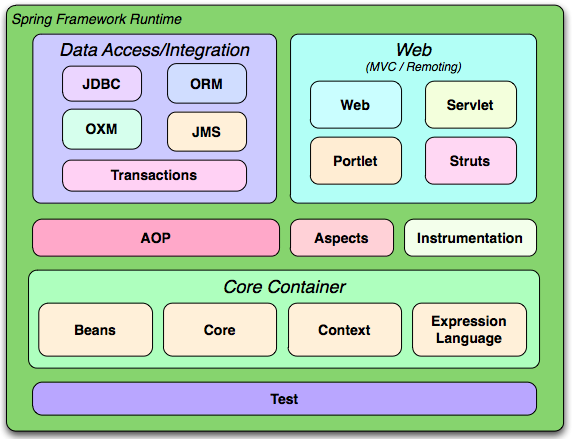
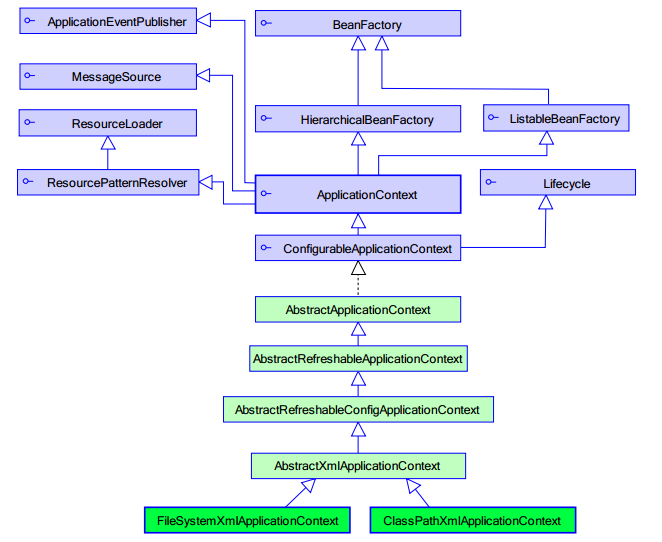
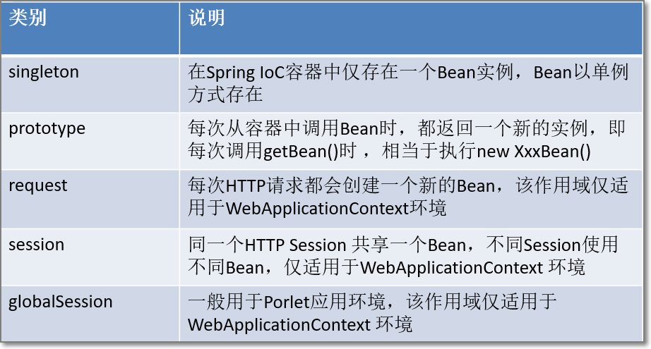
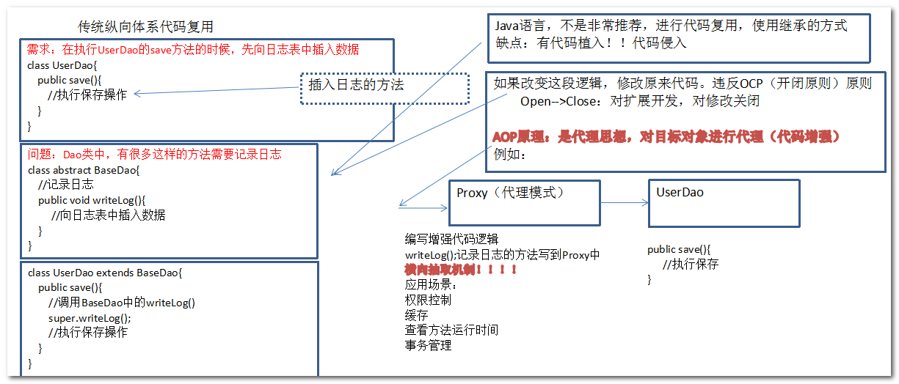

# Spring

- [1. Spring的概述](#1)  
- [2. Spring的核心](#2)  
- [3. Spring工厂](#3)  
- [4. Bean的作用域](#4)  
- [5. Bean的初始化与销毁方法](#5)  
- [6. 后处理Bean: BeanPostProcessor接口](#6)  
- [7. Bean的依赖注入](#7)  
- [8. p名称空间](#8)  
- [9. spEL](#9)  
- [10. 注解配置Bean](#10)  
- [11. Spring与Web的整合](#11)  
- [12. Junit测试集成](#12)  
- [**13. AOP面向切面编程**](#13)

## 1. Spring的概述
- Spring是分层的, JavaSE/EE一站式(full-stack), 轻量级开源框架.
    - 一站式
        - Spring提供了JavaEE各层的解决方案:
        - 表现层: struts1, struts2, Spring MVC
        - 业务层: Ioc, AOP, 事务控制
        - 持久层: JdbcTemplate, HibernateTemplate, ORM框架(对象关系映射)整合

    - 轻量级: Spring的出现取代了EJB的臃肿,低效,繁琐复杂,脱离现实的情况. 而且使用spring编程是非侵入式的. 
- Spring框架是一个分层架构, 它包含一系列的功能要素并被分为大约20个模块, 这些模块分为`Core`, `Container`, `Data Access/Integration`, `Web`, `AOP(Aspect Oriented Programming)`, `Instrumentation`和`测试部分`. 如图:
- 核心容器(Core Container) 包括`Core`、`Beans`、`Context`、`EL`模块。
    - 1：`Core`和`Beans`模块提供了Spring最基础的功能，提供IoC和依赖注入特性。这里的基础概念是BeanFactory，它提供对Factory模式的经典实现来消除对程序性单例模式的需要，并真正地允许你从程序逻辑中分离出依赖关系和配置。
    - 2：`Context`模块基于`Core`和`Beans`来构建，它提供了用一种框架风格的方式来访问对象，有些像JNDI注册表。`Context`封装包继承了beans包的功能，还增加了国际化`I18N`, 事件传播, 资源装载, 以及透明创建上下文，例如通过servlet容器，以及对大量JavaEE特性的支持，如EJB、JMX。核心接口是ApplicationContext。
    - 3：`Expression Language`, 表达式语言模块，提供了在运行期间查询和操作对象图的强大能力。支持访问和修改属性值，方法调用，支持访问及修改数组、容器和索引器，命名变量，支持算数和逻辑运算，支持从Spring 容器获取Bean，它也支持列表投影、选择和一般的列表聚合等。
- 数据访问/集成部分(`Data Access`/`Integration`)
    - 1：JDBC模块，提供对JDBC的抽象，它可消除冗长的JDBC编码和解析数据库厂商特有的错误代码。
    - 2：ORM模块，提供了常用的"对象/关系"映射APIs的集成层。 其中包括`JPA`、`JDO`、`Hibernate` 和 `iBatis` 。利用ORM封装包，可以混合使用所有Spring提供的特性进行"对象/关系"映射，如简单声明事务管理 。
    - 3：OXM模块，提供一个支持Object和XML进行映射的抽象层，其中包括`JAX`B、`Castor`、`XMLBeans`、`JiBX`和`XStream`。
    - 4：`JMS`模块，提供一套"消息生产者、消费者"模板用于更加简单的使用`JMS`，`JMS`用于用于在两个应用程序之间，或分布式系统中发送消息，进行异步通信。
    - 5：`Transaction`模块，支持程序通过简单声明性 事务管理，只要是Spring管理对象都能得到Spring管理事务的好处，即使是POJO，也可以为他们提供事务。
- Web
    - 1：`Web`模块，提供了基础的web功能。例如多文件上传、集成IoC容器、远程过程访问、以及`Web Service`支持，并提供一个RestTemplate类来提供方便的Restful services访问
    - 2：`Web-Servlet`模块，提供了Web应用的Model-View-Controller（MVC）实现。Spring MVC框架提供了基于注解的请求资源注入、更简单的数据绑定、数据验证等及一套非常易用的JSP标签，完全无缝与Spring其他技术协作。
    - 3：`Web-Struts`模块， 提供了对Struts集成的支持，这个功能在Spring3.0里面已经不推荐了，建议你迁移应用到使用Struts2.0或Spring的MVC。
    - 4：`Web-Portlet`模块，提供了在Portlet环境下的MVC实现
- AOP
    - 1：AOP模块，提供了符合AOP 联盟规范的面向方面的编程实现，让你可以定义如方法拦截器和切入点，从逻辑上讲，可以减弱代码的功能耦合，清晰的被分离开。而且，利用源码级的元数据功能，还可以将各种行为信息合并到你的代码中 。
    - 2：`Aspects`模块，提供了对AspectJ的集成。
    - 3：`Instrumentation`模块， 提供一些类级的工具支持和ClassLoader级的实现，可以在一些特定的应用服务器中使用。
- Test
    - 1：`Test`模块，提供对使用JUnit和TestNG来测试Spring组件的支持，它提供一致的ApplicationContexts并缓存这些上下文，它还能提供一些mock对象，使得你可以独立的测试代码。

## 2. Spring的核心
- IoC(Inverse of Control 控制反转): 将对象创建权利交给Spring工厂进行管理.比如说:
----
    //工厂类中的方法:
	public Object getBean(){
		Object bean = null;
		try {
			//传入类字符串,生产对象实例
			bean = Class.forName("xl.idea.pojo.Book").newInstance();
		} catch (Exception e) {
			e.printStackTrace();
		}
		//返回具体类型的对象类型实例
		return bean;
	}
    //那么只要通过工厂就可以获取对象
    Book book = (Book)Spring工厂.getBean()

- DI: Dependency Injection 依赖注入, 在Spring框架负责创建Bean对象时, 动态的将依赖对象注入到Bean组件(简单的说, 可以将另外一个bean对象动态的注入到另外一个bean中.)
- AOP(Aspect Oriented Programming 面向切面编程), 基于动态代理的功能增强方式. 

## 3. Spring工厂
- ApplicationContext直译为应用上下文, 是用来加载Spring框架配置文件, 来构建Spring的工厂对象, 它也称之为Spring容器的上下文对象, 也称之为Spring的容器. 
- ApplicationContext只是BeanFactory(Bean工厂, Bean就是一个java对象)一个子接口:

- 问:为什么不直接使用顶层接口对象来操作呢? 
- 答:ApplicationContext是对BeanFactory扩展, 提供了更多功能
    - 国际化处理
    - 事件传递
    - Bean自动装配
    - 各种不同应用层的Context实现
- 实例化Bean的四种方式
----
    public class MyBean{
    }
- 方式一:无参构造器(最常用)
----
    //applicationcontext.xml中:
    <!-- 默认构造器实例化对象 -->
	<bean id ="bean" class="xl.pojo.MyBean" />
    测试方法:
    public  void test(){
		// 创建spring工厂
		ApplicationContext ac = new ClassPathXmlApplicationContext("applicationContext.xml");
		// 默认构造器获取bean对象
		MyBean bean = (MyBean) ac.getBean("bean");
	}

- 方式二: 静态工厂方法
----
    // 创建静态工厂
    public class MyBeanFactory {
        // 静态方法，用来返回对象的实例
        public static MyBean getMyBean(){
            // 在做实例化的时候，可以做其他的事情，即可以在这里写初始化其他对象的代码
            // Connection conn....
            return new MyBean();
        }
    }
    <!-- 静态工厂获取实例化对象 -->
    <!-- class:直接指定到静态工厂类, factory-method: 指定生产实例的方法, spring容器在实例化工厂类的时候会自动调用该方法并返回实例对象 -->
    <bean id = "myBean" class="xl.pojo.MyBean" factory-method="getMyBean" />

    测试方法:
    public  void test(){
		// 创建spring工厂
		ApplicationContext ac = new ClassPathXmlApplicationContext("applicationContext.xml");
		// 默认构造器获取bean对象
		MyBean bean = (MyBean) ac.getBean("bean");
	}

- 方式三: 实例工厂方法
----
    // 实例工厂: 必须new工厂 --> bean
    public class MyBeanFactory {
        // 普通的方法，非静态方法
        public MyBean getMyBean(){
            //初始化实例对象返回
            return new MyBean();
        }
    }

    <!-- 实例工厂的方式实例化bean -->
	<bean id="MyBeanFactory" class="xl.pojo.MyBean"/>
	<!-- factory-bean相当于ref：引用一个bean对象 -->
	<bean id="myBean" factory-bean="MyBeanFactory" factory-method="getMyBean"/>

- 方式四:FactoryBean方式
----
    // 实现FactoryBean接口的方式
    //泛型: 你要返回什么类型的对象, 泛型就是什么
    public class MyBeanFactoryBean implements FactoryBean<MyBean>{
        // 提供getObject方法, 返回目标类型对象
        public MyBean getObject() throws Exception {
            //写一些初始化数据库连接等等其他代码
            return new MyBean();
        }
        //这里获取泛型的实际类型的代码有待完善
        public Class<?> getObjectType() {
            return null;
        }
        //是否为单例
        public boolean isSingleton() {
            return false;
        }
    }

    <!-- 实现FactoryBean接口实例化对象 -->
	<!-- spring在实例化MyBeanFactoryBean的时候会判断是否实现了FactoryBean接口,如果实现了就调用getObject方法返回实例 -->
	<bean id="myBean" class="xl.pojo.MyBean" />
- 总结
    - 第一种最常用, 第二第三种一些框架初始化的时候用的多, 第四种Spring底层用的多。
    - BeanFactory和FactoryBean的区别？ 
    - BeanFactory: 是一个工厂(其实是构建了一个spring上下文的环境, 容器), 用来管理和获取很多Bean对象. 
    - FactoryBean, 是一个Bean生成工具, 是用来获取一种类型对象的Bean, 它是构造Bean实例的一种方式. 

## 4. Bean的作用域
- 项目开发中通常会使用: singleton 单例, prototype多例 
    - Singleton: 在一个spring容器中, 对象只有一个实例. (默认值)
    - Prototype: 在一个spring容器中, 存在多个实例, 每次getBean返回一个新的实例. 
- 单例是在Spring容器初始化的时候就初始化, 多例是在调用的时候初始化.
----
    <!-- 单例 -->
    <bean id="singletonBean" class="xl.pojo.SingletonBean"/>
    <!-- 多例 -->
    <bean id="prototypeBean" class="xl.pojo.PrototypeBean" scope="prototype"/>

## 5. Bean的初始化与销毁方法
    // 步骤一: 创建`LifeCycleBean`, 指定`init`方法, 和`destroy`方法。
    // 测试生命周期过程中的初始化和销毁bean
    public class LifeCycleBean {
        //定义构造方法
        public LifeCycleBean() {
            System.out.println("LifeCycleBean构造器调用了");		
        }
        //初始化后自动调用方法：方法名随意，但也不能太随便，一会要配置
        public void init(){
            System.out.println("LifeCycleBean-init初始化时调用");
        }
        //bean销毁时调用的方法
        public void destroy(){
            System.out.println("LifeCycleBean-destroy销毁时调用");
        }
    }

    //步骤二:配置Spring容器
    <!-- 生命周期调用的两个方法 
	init-method:初始化时（后）调用的，bean中的共有方法即可
	destroy-method:销毁时（前）被调用的。
	-->
	<bean id="lifeCycleBean" class="xl.spring.lifecycle.LifeCycleBean" init-method="init" destroy-method="destroy" />

    //步骤三: 测试代码:
    @Test
	public void test(){
		//先获取spring的容器，工厂，上下文
		ApplicationContext applicationContext = new ClassPathXmlApplicationContext("applicationContext.xml");
		//对于单例此时已经被初始化
		//获取bean
		LifeCycleBean lifeCycleBean=(LifeCycleBean) applicationContext.getBean("lifeCycleBean");
		System.out.println(lifeCycleBean);
		//为什么没有销毁方法调用。
		//原因是：使用debug模式jvm直接就关了，spring容器还没有来得及销毁对象。
		//解决：手动关闭销毁spring容器，自动销毁单例的对象
		((ClassPathXmlApplicationContext)applicationContext).close();
        // 或者:
        try {
			ac.getClass().getMethod("close").invoke(ac);
		} catch (Exception e) {
			e.printStackTrace();
		}
	}

## 6. 后处理Bean: BeanPostProcessor接口
- 后处理Bean也称之为Bean的后处理器, 作用是在Bean初始化的前后, 对Bean对象进行增强. 它既可以增强一个指定的Bean, 也可以增强所有的Bean, 底层很多功能(如AOP等)的实现都是基于它的, Spring可以在容器中直接识别调用. 

----
    // 步骤一: 创建MyBeanPostProcessor类, 实现接口BeanPostProcessor
    public class MyBeanPostProcessor implements BeanPostProcessor{
        // 初始化时（之前）调用的
        // 参数1：bean对象，参数2，bean的名字，id、name
        public Object postProcessBeforeInitialization(Object bean, String beanName) throws BeansException {
    		System.out.println(beanName+"在初始化前开始增强了");
            // 如何只增强一个bean
            if(beanName.equals("lifeCycleBean")){
                System.out.println(beanName+"在初始化前开始增强了");
            }
            return bean;//放行
        }
        // 初始化时（之后）调用
        public Object postProcessAfterInitialization(Object bean, String beanName) throws BeansException {
    		System.out.println(beanName+"在初始化后开始增强了");
            if(beanName.equals("lifeCycleBean")){
                System.out.println(beanName+"在初始化后开始增强了");
            }
            return bean;
        }
    }

    //步骤二: 在Spring容器中注册
    <!-- 后处理bean: spring在初始化MyBeanPostProcessor的时候，判断是否实现了BeanPostProcessor，如果实现了，就采用动态代理的方式，对所有的bean对象增强 -->
	<bean class="xl.spring.BeanPostProcessor.MyBeanPostProcessor"/>

## 7. Bean的依赖注入
- 第一种：构造器参数注入
----
    <!-- 构造器注入属性的值 -->
	<bean id="car" class="xl.spring.pojo.Car">
        <!-- 
            constructor-arg:告诉spring容器,要调用有参构造方法了,不再调用默认的构造方法
            定位属性:
                index:根据索引定位,第一个索引为0
                name:根据属性参数名称定位
                type:根据参数数据类型定位
                注意:可以多些几个,但不能冲突,一般都用index
            值:
                value:简单的值,字符串
                ref:复杂的值,由spring容器创建的字符串
        -->
        <constructor-arg index="0" value="1"/>
        <constructor-arg index="1" value = "宝马"/>
        <constructor-arg index="2" value = "9999999d"/>
        <!--或者: -->
        <constructor-arg index="0" value="1"/>
        <constructor-arg name = "name">
            <value>宝马</value>
        </constructor-arg>
        <constructor-arg type = "java.lang.Double" value = "9999999d"/>
    </bean>

- 第二种：setter方法属性注入(setter方法的规范需要符合JavaBean规范)
----
    <!-- setter方法属性注入:调用默认构造器，相当于new Person() -->
	<bean id="person" class="xl.spring.pojo.Person">
		<!-- 
            property: 专门进行setter属性注入用的标签 。
            name: setter方法的属性的名字,例如SetXxx-那么name的属性值为xxx。
            value: 简单的值
            ref: bean的名字，对象的引用
		-->
		<property name="id" value="1001"/>
		<property name="name" value="Tom"/>
		<!-- <property name="car" ref="car"/> --><!--等同于-->
		<property name="car">
			<ref bean="car"/>
		</property>
	</bean>

- 第三种：接口注入, Spring框架规范中通过配置文件配置的方式不支持这种方式

## 8. p名称空间
- 为简化XML文件的配置, Spring2.5版本开始引入了一个新的p名称空间. 简单的说, 它的作用是为了简化setter方法属性依赖注入配置的, 它不是真正的名称空间.

- 步骤一: 引入p名称空间
    - `xmlns:p="http://www.springframework.org/schema/p"`
- 步骤二: 
----
    <!--
        使用p名称空间简化setter方法属性注入
        p:name：简单数据类型的属性注入
        P:car-ref：复杂数据类型（bean）的属性注入
    -->
    <bean id="person" class="xl.spring.pojo.Person" p:id="1002" p:name="关羽" p:car-ref="car"/>

## 9. spEL
- spEL(Spring Expression Language)是一种表达式语言, 它是spring3.x版本的新特性.  
- 作用: 支持在运行时操作和查询对象, 其语法类似统一的EL语言, 但是SpEL提供了额外的功能, 功能更强大.
- 语法: #{…} , 引用另一个Bean, 属性, 方法, 运算
    - SpEL表达式的使用功能比较多，Bean操作相关的通常有：
    - #{beanid} 引用Bean(具体对象)
    - #{beanId.属性} 引用Bean的属性
    - #{beanId.方法(参数)} 调用Bean的方法 

    <!-- car.id相当于car.getId() -->
    <bean id="person3" class="xl.spring.pojo.Person" p:id="#{1+1}" p:name="#{'Jack'.toUpperCase()}" p:car="#{car}"/>

## 10. 注解配置Bean
- **Bean的定义注解: 扫描机制**
- 步骤一: spring2.5引入 `@Component` 注解 如果放置到类的上面，相当于在spring容器中定义`<bean id="" class="">`
- 步骤二: 引入context名称空间
----
    <beans xmlns="http://www.springframework.org/schema/beans"
        xmlns:xsi="http://www.w3.org/2001/XMLSchema-instance"
        xmlns:context="http://www.springframework.org/schema/context"
        xsi:schemaLocation="http://www.springframework.org/schema/beans 
                            http://www.springframework.org/schema/beans/spring-beans.xsd
                            http://www.springframework.org/schema/context 
                            http://www.springframework.org/schema/context/spring-context.xsd">
    
- 步骤三: 
----
    <!-- 开启spring的注解功能 ：让注解有效了，识别注解-->
	<context:annotation-config/>
	<!-- 配置注解扫描 
			context:component-scan:专门扫描含有@Component注解的类，自动将其作为bean
			base-package：要扫描包的路径,包含子包,xl.spring表示子包下的所有类定义注解都有效
			注解扫描配置的时候，会自动开启注解功能
	-->
	<context:component-scan base-package="xl.spring"/>

- 配置的优化:
    - 1．在配置包扫描的时候, spring会自动开启注解功能. 所以, 注解开启功能可以不配置. 即去掉:  `<context:annotation-config/>`, 因为`<context:componet-scan>`具有 `<context:annotation-config>`作用! 
    - 2. 衍生注解的问题. 实际开发中, 使用的是`@Component`三个衍生注解(子注解), 子注解的作用:分层(分层注解).
        - `@Service`用于标注业务层组件, 如Service层
        - `@Controller`用于标注控制层组件, 如struts中的action层, SpringMVC中的Controller层.
        - `@Repository`用于标注数据访问组件, 如DAO层组件. 
        - `@Component`泛指组件, 当组件不好归类的时候, 我们可以使用这个注解进行标注.

- **Bean属性的依赖输入注解**
----
    //@Component(value="customerService")//只有value的话可以省略value=
    @Service("customerService")
    public class CustomerService {
        public void save(){
            System.out.println("CustomerService的业务层被调用了");
            System.out.println("name="+name);
            customerDAO.save();
            customerDAO2.save();
            customerDAO3.save();
            customerDAO4.save();
            customerDAO5.save();
            customerDAO6.save();
            customerDAO20.save();
        }
        
        //简单依赖注入
        @Value("Rose")
        private String name;
        
        //对象依赖注入,在属性声明上注入,底层还是生成setter
        //第一种,使用value和spel结合,spring3.0后使用
        @Value("#{customerDAO}")
        private CustomerDAO customerDAO;
        
        
        //第二种,使用@Autowired和@Qualifier
        //单独使用@Autowired,表示按照类型注入,会到spring容器中找CustomerDAO类型,如果找到,可以匹配
        @Autowired
        private CustomerDAO customerDAO2;
        //@AutoWired和@Qualifier表示按照名称注入,回到容器中查找customerDAO的名称,如果找到可以匹配
        @Autowired
        @Qualifier("customerDAO")
        private CustomerDAO customerDAO3;
        
        private CustomerDAO customerDAO4;
        private CustomerDAO2 customerDAO20;
        @Autowired//也可以放置在方法上通过形式参数进行传入,只要全部参数可以在包下(xml中规定)找到,就可以把参数都导入.嗯,是我我也会这么设计
        public void abc(CustomerDAO customerDAO,CustomerDAO2 customerDAO2){
            this.customerDAO4 = customerDAO;
            this.customerDAO20 = customerDAO2;
        }
        
        //第三种,JSR-250标准(基于jdk)提供注解@Resource
        //单独使用@Resource注解,表示先按照名(customerDAO5)称注入,会到spring容器中查找customerDAO的名称,如果找到,可以匹配,如果没找到,会到spring容器中查找CustomerDao的类型,如果还没找到,抛出异常
        @Resource
        private CustomerDAO customerDAO5;
        @Resource(name="customerDao")//只能按照customerDao名称进行匹配
        private CustomerDAO customerDAO6;

        
        
        //第四种,JSR-330标准(基于jdk)提供@Inject,需要导入javax.inject
        @Inject//默认按照类型注入
        @Named("customerDAO")//按照名字注入,需配合@Inject
        private CustomerDAO customerDAO7;
    }

- **Bean的初始化和销毁注解**
    - 使用`@PostConstruct` 注解, 标明初始化方法, 相当于`init-method`指定初始化方法
    - 使用`@PreDestroy`注解, 标明销毁方法, 相当于`destroy-method`指定对象销毁方法 
    - 注意: 如果要执行对象的销毁方法 
	    - 条件一: 单例Bean(在容器close时, 单例Bean才会执行销毁方法)
	    - 条件二: 必须调用容器 close 方法 

----
    //测试生命周期过程中的初始化和销毁bean
    //必须配置包扫描
    @Component("lifeCycleBean")
    public class LifeCycleBean {
        
        public LifeCycleBean() {
            System.out.println("LifeCycleBean构造器调用了");
        }
        
        //初始化后自动调用方法：方法名随意，但也不能太随便，一会要配置
        @PostConstruct//初始化的方法
        public void init(){
            System.out.println("LifeCycleBean-init初始化时调用");
        }
        
        //bean销毁时调用的方法
        @PreDestroy
        public void destroy(){
            System.out.println("LifeCycleBean-destroy销毁时调用");
        }
    }

- **Bean的作用域**
----
    @Component("lifeCycleBean")
    //@Scope(value=ConfigurableBeanFactory.SCOPE_PROTOTYPE)
    @Scope("prototype")//默认是单例(singleton),更改为多例(prototype)
    public class LifeCycleBean {

    }

## 11. Spring与Web的整合
- 方案:将Spring容器绑定到Web Servlet容器上, 让Web容器来管理Spring容器的创建和销毁.
- 具体步骤为: 
    - 1.编写一个ServletContextListener监听器, 在监听ServletContext到创建的时候, 创建Spring容器, 并将其放到ServletContext的属性中保存(setAttribute(Spring容器名字，Spring容器对象)).
    - 2.我们无需手动创建该监听器, 因为Spring提供了一个叫ContextLoaderListener的监听器, 它位于spring-web-3.2.0.RELEASE.jar中.
    - 3.在web容器中配置spring文件路径, 因为默认加载的是WEB-INF/applicationContext.xml, 而不是src下的applicationContext.xml文件. 原因: 找到`ContextLoaderListener.class`, 再找到`ContextLoader.class`, 发现默认加载的WEB-INF/applicationContext.xml
----
    <!-- spring的核心监听器 -->
    <listener>
        <listener-class>org.springframework.web.context.ContextLoaderListener</listener-class>
    </listener>
    <!-- 全局参数变量 -->
    <context-param>
        <param-name>contextConfigLocation</param-name>
        <!-- applicationContext.xml文件的位置，使用classpath定义 -->
        <param-value>classpath:applicationContext.xml</param-value>
    </context-param>

## 12. Junit测试集成
----
    //目标：测试一下spring的bean的某些功能
    @RunWith(SpringJUnit4ClassRunner.class)//junit整合spring的测试//立马开启了spring的注解
    @ContextConfiguration(locations="classpath:applicationContext.xml")//加载核心配置文件，自动构建spring容器
    public class SpringTest {
        //使用注解注入要测试的bean
        @Autowired
        private HelloService helloService;
        
        @Test
        public void testSayHello(){
            //获取spring容器
    		//ApplicationContext applicationContext = new ClassPathXmlApplicationContext("applicationContext.xml");
            //从spring容器中获取bean对象
    		//HelloService helloService=(HelloService)applicationContext.getBean("helloService");
            //测试业务功能
            helloService.sayHello();
        }
    }

## **13. AOP面向切面编程与动态代理**
- `AOP (Aspect Oriented Programing)` 称为：面向切面编程，它是一种编程思想: 基于代理思想，对原来目标对象，创建代理对象，在不修改原对象代码情况下，通过代理对象，调用增强功能的代码，从而对原有业务方法进行增强 ！
- AOP采取横向抽取机制, 取代了传统纵向继承体系重复性代码的编写方式(例如性能监视、事务管理、安全检查、缓存、日志记录等).

- OCP: 开闭原则
    - 对扩展开放,对修改关闭. 在程序需要进行扩展的时候,不能去修改原有的代码, 实现一个一个热拔插的效果.
    - 目的是为了使程序的扩展性好,易于维护和升级.

- AOP的两种实现
    - Spring AOP使用纯Java实现，不需要专门的编译过程和类加载器，在运行期通过代理方式向目标类植入增强代码。
    - AsPectJ是一个基于Java语言的第三方AOP框架，Spring2.0开始，Spring AOP引入对Aspect的支持。推荐使用

- **AOP相关术语**:
    - `Aspect`(切面): 是通知和切入点的结合, 通知和切入点共同定义了关于切面的全部内容: 它的功能、在何时和何地完成其功能.
    - `joinpoint`(连接点): 所谓连接点是指那些被拦截到的点. 在spring中, 这些点指的是方法, 因为spring只支持方法类型的连接点.
    - `Pointcut`(切入点): 所谓切入点是指我们要对哪些joinpoint进行拦截的定义. 通知定义了切面的"什么"和"何时", 切入点就定义了"何地".
    - `Advice`(通知): 所谓通知是指拦截到joinpoint之后所要做的事情就是通知. 通知分为前置通知, 后置通知, 异常通知, 最终通知, 环绕通知(切面要完成的功能)
    - `Target`(目标对象): 代理的目标对象
    - `weaving`织入: 是指把切面应用到目标对象来创建新的代理对象的过程.切面在指定的连接点织入到目标对象
    - `Introduction`(引入):在不修改类代码的前提下, Introduction可以在运行期为类动态地添加一些方法或Field.

- 动态代理和静态代理区别？ 
    - 动态代理：在虚拟机内部，运行的时候，动态生成代理类(运行时生成，runtime生成) ，并不是真正存在的类， 一般格式：Proxy$$ （Proxy$$Customer）
    - 静态代理：实际存在代理类 （例如：struts2 Action的代理类 ActionProxy，struts2的拦截器）

-  Spring AOP是基于动态代理的, 基于两种动态代理机制: JDK动态代理和CGLIB动态代理 

- **JDK动态代理:**
- 方案一: 在内部实现new InvocationHandler(), 指定匿名内部类
- 方案二: 传递内部类的对象, 指定内部类
- 方案三: 直接使用调用类作为接口实现类, 实现InvocationHandler接口
----
    //这是方案一,方案二方案三都类似
    //专门用来生成jdk的动态代理对象的-通用
    //生成代理类的工厂类
    public class JdkProxyFactory{
        //维护一个代理的目标对象
        private Object target;
        //注入target目标对象
        public JdkProxyFactory(Object target) {
            this.target = target;
        }
        
        public Object getProxyObject(){
            //参数1：目标对象的类加载器
            //参数2：目标对象实现的接口
            //参数3：回调方法对象
            /**方案一：在内部实现new InvocationHandler()，指定匿名内部类*/
            return Proxy.newProxyInstance(target.getClass().getClassLoader(), target.getClass().getInterfaces(), new InvocationHandler(){
                //参数一: 就是上面的代理对象
                //参数二: 调用的方法
                //参数三: 调用方法的参数, TODO 不确定
                public Object invoke(Object proxy, Method method, Object[] args)
                        throws Throwable {
                    //如果是保存的方法，执行记录日志操作
                    if(method.getName().equals("save")){
                        writeLog();
                    }
                    //目标对象原来的方法执行
                    Object object = method.invoke(target, args);//调用目标对象的某个方法，并且返回目标对象方法的返回值
                    return object;
                }
                
            });
        }
        
        //记录日志
        private static void writeLog(){
            System.out.println("增强代码：写日志了。。。");
        }
    }

- **Cglib动态代理**
    - Cglib(Code Generation Library)的引入为了解决类的直接代理问题(生成代理子类), 不需要接口也可以代理. 代理类是目标类的子类
    - spring-core中包含了cglib包
----
    public class CglibProxyFactory implements MethodInterceptor{

        //声明一个代理对象的引用
        private Object target;
        //注入代理对象
        public CglibProxyFactory(Object target) {
            this.target = target;
        }
        
        //获取代理对象,其实这是一个工厂方法
        public Object getProxyObject(){
            //1.代理对象生成器(工厂思想)
            Enhancer enhancer = new Enhancer();
            //2.在增强器上设置两个属性
            //设置要生成代理对象的目标对象:生成的目标对象类型的子类型
            enhancer.setSuperclass(target.getClass());
            //设置回调方法		TODO 为什么传一个this进去? 答:把本类对象传进去后就可以来调用下面的interceptor方法了.
            enhancer.setCallback(this);
            //创建获取对象
            return enhancer.create();
        }
        
        /**回调方法, 相当于jdkProxy的handler
        * 参数1:代理对象
        * 参数2:目标对象的方法对象
        * 参数3:目标对象的方法的参数数组
        * 参数4:代理对象的方法对象,这个参数有什么用?难道和目标对象的参数不一样?		TODO
        * */
        @Override
        public Object intercept(Object proxy, Method method, Object[] args, MethodProxy methodProxy) throws Throwable {
            if("save".equals(method.getName())){
                writeLog();
            }
            return method.invoke(target, args);
        }

        private void writeLog() {
            System.out.println("cglib的增强代码:来写日志了");
            
        }
    }
- 测试类
----
    //cglib动态代理：可以基于类（无需实现接口）生成代理对象
	@Test
	public void testCglibProxy(){
		//target目标：
		ProductService target = new ProductService();
		//weave织入，生成proxy代理对象
		//代理工厂对象，注入目标
		CglibProxyFactory cglibProxyFactory = new CglibProxyFactory(target);
		//获取proxy:思考：对象的类型
		//代理对象，其实是目标对象类型的子类型
		ProductService proxy=(ProductService) cglibProxyFactory.getProxyObject();
		//调用代理对象的方法
		proxy.save();
		System.out.println("————————————————————————————————————————");
		proxy.find();
		
	}

- 动态代理总结
    - 两种动态代理的区别:
        - Jdk代理: 基于接口的代理, 一定是基于接口, 会生成目标对象的接口类型的子对象. 
        - Cglib代理: 基于类的代理, 不需要基于接口, 会生成目标对象类型的子对象. 
    - Spring在运行期, 生成动态代理对象, 不需要特殊的编译器.
    - Spring AOP有两种代理方式：
        - 1.若目标对象实现了若干接口，spring使用JDK的`java.lang.reflect.Proxy`类代理。
        - 2.若目标对象没有实现任何接口，spring使用CGLIB库生成目标对象的子类。
        - Spring AOP 优先对接口进行代理(使用Jdk动态代理), 如果目标对象没有实现任何接口, 才会对类进行代理(使用cglib动态代理)

    - 使用该方式时需要注意:
        - 1.对接口创建代理优于对类创建代理，因为会产生更加松耦合的系统，所以spring默认是使用JDK代理。对类代理是让遗留系统或无法实现接口的第三方类库同样可以得到通知，这种方式应该是备用方案。
        - 2.标记为final的方法不能够被通知。spring是为目标类产生子类。任何需要被通知的方法都被复写，将通知织入。final方法是不允许重写的。
        - 3.spring只支持方法连接点：不提供属性接入点，spring的观点是属性拦截破坏了封装。面向对象的概念是对象自己处理工作，其他对象只能通过方法调用的得到的结果。

## 14. 传统Spring AOP编程
- 传统Spring AOP的通知（增强）种类：
- AOP联盟为通知Advice定义了`org.aopalliance.aop.Interface.Advice`
- Spring按照通知Advice在目标类方法的连接点位置，可以分为5类
    - 1. 前置通知 `org.springframework.aop.MethodBeforeAdvice` 在目标方法执行前实施增强
    - 2. 后置通知 `org.springframework.aop.AfterReturningAdvice` 在目标方法执行后实施增强
    - 3. 环绕通知 `org.aopalliance.intercept.MethodInterceptor` 在目标方法执行前后实施增强
    - 4. 异常抛出通知 `org.springframework.aop.ThrowsAdvice` 在方法抛出异常后实施增强
    - 5. 引介通知 `org.springframework.aop.IntroductionInterceptor` 在目标类中添加一些新的方法和属性

- 编写步骤:
    - 1、确定目标对象（target—>bean）
    - 2、编写Advice通知方法 （增强代码）
    - 3、配置切入点和切面 
----
    //传统的advice通知,增强类,必须实现org.aopalliance.intercept.MethodInterceptor接口,注意和cglib的MethodInterceptor区别开
    public class TimerLogInterceptor implements MethodInterceptor{
        private static Logger LOG = Logger.getLogger(TimerLogInterceptor.class);
        
        //回调方法
        //参数:目标方法回调函数的包装类,获取调用方法的相关属性,方法名,调用该方法的对象(即封装了方法,目标对象,方法的参数)
        @Override
        public Object invoke(MethodInvocation methodInvocation) throws Throwable {
            //需求:计算目标方法的运行时间
            long beginTime = System.currentTimeMillis();
            //目标对象原来的方法的调用,返回目标对象方法的返回值
            Object object = methodInvocation.proceed();//类似于invoke();
            //方法调用之后记录时间
            long endTime = System.currentTimeMillis();
            //计算运行时间
            long runTime = endTime-beginTime;
            //写日志:
            /**
            * 1.记录日志到数据库:优势:便于查询,劣势:要占用数据库空间,日志一般度非常庞大
            * 2.记录日志到log4j:优势:文件存储可以记录非常大的日志数据,劣势:不便于查询
            * */
            LOG.info("方法名为:"+methodInvocation.getMethod().getName()+"运行时间为:"+runTime+"毫秒");
            return object;
        }
    }

    //在xml中配置:
    <!-- 1.确定要增强的target对象 -->
    <!-- 对与spring来说,目标就是bean对象 -->
    <!-- 基于接口 -->
    <bean id = "customerService" class = "i_dynamicproxy.CustomerService"/>
    <!-- 基于一般类 -->
    <bean id = "productService" class = "i_dynamicproxy.ProductService"/>

    <!-- 2.配置通知(增强): Advice -->
    <bean id = "timerLogAdvice" class = "j_tranditionalaop.TimerLogInterceptor"/>

    <!-- 3.配置切入点和切面:aop:config -->
    <aop:config>
        <!-- 
            配置切入点:即要拦截的连接点(方法)
            express:表达式:匹配方法的,语法:aspectj的语法
            表达式:bean(bean的名字),要对哪些bean中的所有方法增强
        -->
        <aop:pointcut expression="bean(*Service)" id="myPointCut"/>
        <aop:advisor advice-ref="timerLogAdvice" pointcut-ref="myPointCut"/>
    </aop:config>

- 配置`<aop:config>`后,获取出来的`customerService`和`productService`就已经是代理类了. 
- 切入点表达式的语法整理如下：
    - `bean(bean Id/bean name)` 
        - `bean(customerService)` 增强spring容器中定义id属性/name属性为customerService的bean中所有方法 
    - `execution(<访问修饰符>?<返回类型>空格<方法名>(<参数>)<异常>?)`
        - `execution(* xl.spring.a_jdkproxy.CustomerServiceImpl.*(..))` 增强bean对象所有方法
        - `execution(* xl.spring..*.*(..))` 返回类型任意, `xl.spring`包及其子包中所有类，类中所有方法, 参数任意
        - `execution(* *..*.*(..))` 返回类型任意, 任意包中及其子包中所有类, 类中所有方法, 参数任意

## 15. AspectJ切面编程
- **xml方式**
- AspectJ提供不同的通知类型：
    - Before 前置通知，相当于BeforeAdvice
    - AfterReturning 后置通知，相当于AfterReturningAdvice
    - Around 环绕通知，相当于MethodInterceptor
    - AfterThrowing抛出通知，相当于ThrowAdvice
    - After 最终final通知，不管是否异常，该通知都会执行
    - DeclareParents 引介通知，相当于IntroductionInterceptor (不要求掌握)
- 以前置通知为例子,每种通知都有自己不同的写法.
- 第一步：确定目标对象，即确定bean对象:
----
    <!-- 1.确定了要增强的target对象 -->
	<!-- 对于spring来说，目标对象：就是bean对象 -->
	<!-- 基于接口类 -->
	<bean id="customerService" class="xl.spring.a_proxy.CustomerServiceImpl"/>
	<!-- 基于一般类 -->
	<bean id="productService" class="xl.spring.a_proxy.ProductService"/>

- 第二步：编写Before 并配置前置通知Advice增强:
----
    //aspectj的advice通知增强类，无需实现任何接口
    public class MyAspect {
        //前置通知
        //普通的方法。方法名随便，但也不能太随便，一会要配置
        public void firstbefore(){
            System.out.println("------------第一个个前置通知执行了。。。");
        }
    }

    <!--将前置通知配置到spring的容器中-->
    <!-- 2.配置advice通知增强 -->
    <bean id="myAspectAdvice" class="xl.spring.c_aspectjaop.MyAspect"/>

- 配置切面与切入点, 让切入点关联通知
----
    <!-- 2.配置advice通知增强 -->
	<bean id="myAspectAdvice" class="xl.spring.c_aspectjaop.MyAspect"/>
	
	<!-- 3：配置aop -->
	<aop:config>
		<!-- 切入点:拦截哪些bean的方法 -->
		<aop:pointcut expression="bean(*Service)" id="myPointcut"/>
		<!--
			切面：要对哪些方法进行怎样的增强  
			aop:aspect:aspejctj的方式！
			ref:配置通知
		-->
		<aop:aspect ref="myAspectAdvice">
			
			<!-- 第一个前置通知 ：在访问目标对象方法之前，先执行通知的方法
				method：advice类中的方法名，
                pointcut-ref="myPointcut"：注入切入点
                目的是让通知关联切入点
			-->
		    <aop:before method="firstbefore" pointcut-ref="myPointcut"/>
		</aop:aspect>
	</aop:config>

- 各种Advice方法可接收的参数和返回值小结
----
| 通知类型               | 输入参数(可选)            | 返回值类型   |  其他             |
|:----------------------|:-------------------------|:------------|:-----------------|
| Before前置通知         | JoinPoint(静态连接点信息) | void        |                  |
| AfterReturning后置通知 | JoinPoint, Object        | void        |                  |
| Around环绕通知         | ProcessdingJoinPoint     | Object      | throws Throwable |
| AfterThrowing抛出通知  | JoinPoint, Throwable     | void        |                  |
| After最终通知          | JoinPoint                | void        |                  |

- **注解方式**
- 在切面的类, 通知方法上添加
    - @AspectJ提供不同的通知类型
    - @Before 前置通知，相当于BeforeAdvice
    - @AfterReturning 后置通知，相当于AfterReturningAdvice
    - @Around 环绕通知，相当于MethodInterceptor
    - @AfterThrowing抛出通知，相当于ThrowAdvice
    - @After 最终final通知，不管是否异常，该通知都会执行
    - @DeclareParents 引介通知，相当于IntroductionInterceptor (不要求掌握)

- 步骤一: 在xml中定义`customerService`和`productService`
- 步骤二: 编写通知类，在通知类 添加@Aspect 注解，代表这是一个切面类,并将切面类交给spring管理（能被spring扫描到@Component）。
----
    @Component("aspectJAdvice")
    @Aspect//相当于<aop:aspect ref = "aspectJAdvice">
    public class AspectJAdvice {
        //前置通知
        //应用:权限控制(权限不足,抛出异常),记录方法调用信息日志
        //参数:org.aspectj.lang.JointPoint,连接点对象,封装了方法,参数,目标对象
        @Before("bean(*Service)")//<aop:before method="before" pointcut="bean(*Service)"/>
        public void before(JoinPoint joinPoint){
            //假设当前登录用户
            String loginName = "Rose";
            System.out.println("方法名称对象:"+joinPoint.getSignature().getName());
            System.out.println("目标对象:"+joinPoint.getTarget().getClass().getSimpleName());
            System.out.println("代理对象:"+joinPoint.getThis().getClass().getSimpleName());
            
            //判断用户有没有执行方法的权限
            /*if("save".equals(joinPoint.getSignature().getName())){
                //只有admin有权限
                if(!"admin".equals(loginName)){
                    throw new RuntimeException("您没有权限执行"+joinPoint.getSignature().getName()+"方法");
                }
            }*/
        }
        
        //前置通知方案二:使用@Pointcut定义切入点
        //切入点语法要求:private void 无参数,无方法体的方法,方法名为切入点的名称
        //一个通知方法@Before可以使用多个切入点表达式，中间使用“||”符合分隔，用来表示多个切入点 
        @Pointcut("bean(customerService)")//<aop:pointcut expression="bean(*Service)" id = "firstBefore"/>
        private void firstBefore(){
            System.out.println("----------第一个前置通知执行了-------------");
        }
        @Pointcut("bean(productService)")
        private void firstBefore2(){
            System.out.println("----------第二个前置通知执行了-------------");
        }
        //@Before("firstBefore()||firstBefore2()")
        //@Before("bean(*Service)")//这样不也一样么....
        //@Before("firstBefore()")
        public void before2(JoinPoint joinPoint){
            System.out.println("---------前置通知方案二------------");
        }
        
        //后置通知
        //应用:查询余额后,自动下发短信功能
        //参数1:连接点对象性
        //参数2:目标方法执行后的返回值,类型是object,参数名随便
        @AfterReturning(value = "bean(*Service)",returning = "returnVal")
        public void afterReturning(JoinPoint joinPoint,Object returnVal){
            System.out.println("*****您账户余额不足,快给我充钱!我给你VIP100000000000000,好吧,其实还有"+returnVal+"块钱*****");
        }
        
        //环绕通知
        //应用:日志,缓存,权限,性能监控,事务管理
        //参数:可以执行的连接点对象ProceedingJoinPoint,特点是调用proceed()方法可以随时随地地执行目标对象的方法(相当于目标对象的方法被执行了)
        //必须返回Object 抛出Throwable
        @Around("bean(*Service)")
        public Object around(ProceedingJoinPoint pjp) throws Throwable{
            System.out.println("-----事务开启了-----");
            Object resultObject = pjp.proceed();//放行
            System.out.println("-----事务提交了-----");
            return resultObject;//返回对象执行的结果
        }
        
        //抛出通知
        //应用:处理异常,记录日志
        //参数1:静态连接点(方法对象)
        //参数2:目标方法抛出的异常
        @AfterThrowing(value="bean(*Service)", throwing = "e")
        public void afterThrowing(JoinPoint joinPoint, Throwable e){
            System.out.println("管理员好!"+joinPoint.getTarget().getClass().getName()+"的方法:"+joinPoint.getSignature().getName()+"发生了异常,异常为:"+e.getMessage());
        }
        
        //最终通知
        //应用:释放资源,关闭文件,数据库,网络连接等....
        @After("bean(*Service)")
        public void after(JoinPoint joinPoint){
            System.out.println("释放资源了,执行的方法是"+joinPoint.getSignature().getName());
        }
    }

