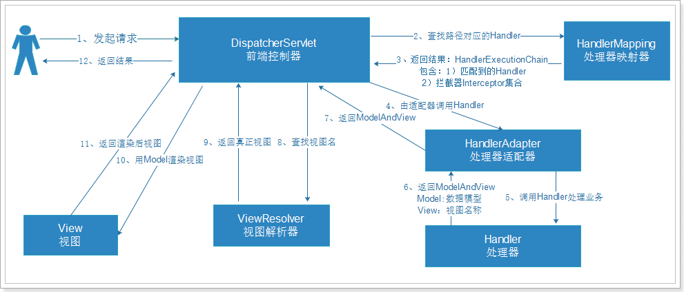

# SpringMVC

- [1. SpringMVC与MVC简介](#1)  
- [2. 配置文件](#2)  
- [3. 注解](#3)  
-   
-   

## 1. SpringMVC与MVC简介
- MVC是一种架构模型, 本身没有什么功能, 只是让我们的项目结构更加合理, 流程控制更加清晰, 一般包含三个组件:
    - Model(模型): 数据模型, 用于提供要展示的数据. 一般包含数据和行为(也就是业务), 在JavaWEB中, 数据和业务往往是分离开的.
    - View(视图): 负责对模型数据进行展示, 例如我们看到的网页. 概念比较广泛, 可以是: html, jsp, excel, word, pdf, json, xml等.
    - Controller(控制器):接收用户请求, 委托给模型做处理, 处理完毕返回数据, 再交给视图做渲染, 相当于调度员工作.
- Spring Web MVC是一种基于Java的,实现了Web MVC设计模式的轻量级Web框架, 使用了MVC架构模式的思想, 将web层进行职责解耦, 采用了松散耦合可插拔组件结构, 比其它MVC框架更具扩展性和灵活性. 
- SpringMVC架构:structure

- 流程总结:
    - 1. 用户发起请求到`DispatcherServlet(前端控制器)`
    - 2.`DispatcherServlet`通过`HandlerMapping(处理映射器)`寻找用户要请求的Handler
    - 3.`HandlerMapping`返回执行链, 包含两部分内容:
        - 处理器对象: `Handler`
        - `HandlerInterceptor(拦截器)`的集合
    - 4. 前端控制器通过HandlerAdapter（处理器适配器）对Handler进行适配包装
    - 5. 调用包装后的Handler中的方法, 处理业务
    - 6. 处理业务完, 返回`ModelAndView`对象, 包含两部分: 
        - Model: 模型数据
        - View: 视图名称, 不是真正的视图
    - 7. `DispatcherServlet`获取处理得到的`ModelAndView`对象
    - 8. `DispatcherServlet`将视图名称交给`ViewResolver(视图解析器)`查找视图
    - 9. `ViewResolver`返回真正的视图对象给`DispatcherServlet`
    - 10. `DispatcherServlet`把Model(数据模型)交给视图对象进行渲染
    - 11. 返回渲染后的视图
    - 12. 将最终的视图返回用户, 产生响应

## 2. 配置文件
- web.xml中引入`DispatcherServlet`
----
    <servlet>
		<servlet-name>springmvc</servlet-name>
		<servlet-class>org.springframework.web.servlet.DispatcherServlet</servlet-class>
		<!-- 0：第一次被调用时创建； 1：Tomcat启动时就创建 -->
		<load-on-startup>1</load-on-startup>
	</servlet>
	
	<servlet-mapping>
		<servlet-name>springmvc</servlet-name>
		<!-- 
			/*		： 	匹配所有请求路径，不要用
			/		：	匹配除了.jsp以为的所有请求
			*.xxx	：	匹配以xxx为后缀的路径
		 -->
		<url-pattern>*.do</url-pattern>
	</servlet-mapping>

- SpringMVC配置文件, 其实就是类似于Spring的applicationContext.xml的一个配置文件(头一样), 配置SpringMVC需要使用到的bean, 例如HandlerMapping，HandlerAdapter等. `DispatcherServlet`默认是去寻找: WEB-INF/{servlet-name}-servlet.xml, 如果按上面的代码的话,应该找springmvc-servlet.xml.
    - HandlerMapping与HandlerAdapter有默认配置, 不配也可以, 默认配置见webmvc jar下的prg.springframework.web.servlet包下的DispatcherServlet.properties
----
    <?xml version="1.0" encoding="UTF-8"?>
    <beans xmlns="http://www.springframework.org/schema/beans"
        xmlns:xsi="http://www.w3.org/2001/XMLSchema-instance" xmlns:p="http://www.springframework.org/schema/p"
        xmlns:context="http://www.springframework.org/schema/context"
        xmlns:mvc="http://www.springframework.org/schema/mvc"
        xsi:schemaLocation="http://www.springframework.org/schema/beans http://www.springframework.org/schema/beans/spring-beans.xsd
            http://www.springframework.org/schema/mvc http://www.springframework.org/schema/mvc/spring-mvc-4.0.xsd
            http://www.springframework.org/schema/context http://www.springframework.org/schema/context/spring-context.xsd">
        
        <!-- 配置HandlerMapping -->
        <bean class="org.springframework.web.servlet.handler.BeanNameUrlHandlerMapping"/>
        <!-- 配置HandlerAdapter -->
        <bean class="org.springframework.web.servlet.mvc.SimpleControllerHandlerAdapter"/>
        
        <!--由于上面配置的是BeanNameUrlHandlerMapping,所以这儿一定要有name属性,HandlerMapping才能找到-->
        <bean name="/hello.do" class="xl.idea.springmvc.controller.HelloHandler"/>

        <!-- 配置视图解析器 ,会去找项目内部的静态资源作为视图，默认的路径是：prefix + 视图名称 + suffix
            Example: prefix="/WEB-INF/jsp/", suffix=".jsp", viewname="test" -> "/WEB-INF/jsp/test.jsp" 
        -->
        <bean class="org.springframework.web.servlet.view.InternalResourceViewResolver">
            <property name="prefix" value="/WEB-INF/views/" />
            <property name="suffix" value=".jsp" />
        </bean>
    </beans>

    <!--class文件:-->
    public class HelloHandler implements Controller {
        public ModelAndView handleRequest(HttpServletRequest request, HttpServletResponse response) throws Exception {
            //创建一个模型和视图对象
            ModelAndView mv = new ModelAndView("hello");
            //也可以通过set方法设置视图名称
            //mv.setViewName("hello");
            //添加模型数据,在SpringMVC中,Model是一个类似Map结构的容器,以键值对形式存储数据
            mv.addObject("message","这是我的第一个SpringMVC程序");
            return mv;
        }
    }

## 3. 注解
- 在Spring2.5以后, 就引入了注解方式的控制器定义方式, 并且在Spring3.0以后引入了更多非常强大的注解帮我们进行参数注入. 
- 在web.xml中
----
    <!--由于上面配置的是BeanNameUrlHandlerMapping,所以这儿一定要有name属性,HandlerMapping才能找到-->
    <bean name="/hello.do" class="xl.idea.springmvc.controller.HelloHandler"/>

    <!--不再配置Controller的Bean了, 直接配置包扫描-->
    <context:component-scan base-package="xl.idea.springmvc"/>

    <!--由于注解默认配置的HandlerMapping和HandlerAdapter已过时,所以应重新设置这两个bean-->
    <!--<bean class="org.springframework.web.servlet.mvc.method.annotation.RequestMappingHandlerAdapter"/>
    <bean class="org.springframework.web.servlet.mvc.method.annotation.RequestMappingHandlerMapping"/>-->
    <!--如果开启了注解驱动,就不用配置HandlerMapping和HandlerAdapter了, 因为如果配置了注解驱动开关,那么注解驱动的类被加载后, 会自动加载这两个HandlerMapping和HandlerAdapter和其他几个,Mapping/Adapter-->
    <mvc:annotation-driven />

    <!--配置视图解析器
        这里是内部资源视图解析器,就是指向项目内的文件,需要指定suffix和prefix,则文件最终路径就是:
        prefix + 视图名称 + suffix
        这里采用的是字符串拼接,一定要注意/的问题.
    -->
    <bean class="org.springframework.web.servlet.view.InternalResourceViewResolver">
        <property name="prefix" value="/WEB-INF/views/"/>
        <property name="suffix" value=".jsp"/>
    </bean>

- Controller类
----
    //通过Controller注解表明这是一个控制器类
    @Controller
    //可写可不写,写了就要在访问路径中加上/TestController,这里配置的时候/可加可不加,如果不加会自动补全.
    @RequestMapping("TestController")
    public class TestController {

        //通过RequestMapping定义当前方法的映射路径,在浏览器中通过这个路径访问这个方法
        //http://localhost/show1.do
        @RequestMapping("show1")
        public ModelAndView show1(){
            ModelAndView mv = new ModelAndView("hello");
            mv.addObject("msg", "我的第一个SpringMVC程序");
            return mv;
        }

        //Ant风格路径映射
        /**
        * ?    匹配一个字符
        * *    匹配零个或多个字符
        * **   匹配零个或多个路径
        */
        @RequestMapping("/**/show2")
        public ModelAndView show2(){
            ModelAndView mv = new ModelAndView("hello");
            mv.addObject("msg", "Ant风格映射**");
            return mv;
        }

        //占位符映射
        @RequestMapping("show3/{id}")
        //可以通过@PathVariable注解获取路径占位符中的变量值,并且可以映射为String或数值类型
        public ModelAndView show3(@PathVariable("id") Long id){
            ModelAndView mv = new ModelAndView("hello");
            mv.addObject("msg", "占位符映射,id为:"+id);
            return mv;
        }

        //占位符映射,请求方式限定,可以写多个请求方式.
        @RequestMapping(value = "show4/{id}", method = RequestMethod.POST)
        //可以通过@PathVariable注解获取路径占位符中的变量值,并且可以映射为String或数值类型
        public ModelAndView show4(@PathVariable("id") Long id){
            ModelAndView mv = new ModelAndView("hello");
            mv.addObject("msg", "占位符映射,id为:"+id + "如果正确显示,则为POST请求方式");
            return mv;
        }

        //参数请求限定

        /**
        * 参数限定规则:
        * params = "id"    请求参数中必须包含id
        * params = "!id"    请求参数中不能包含id
        * params = "id!=1"    请求参数中必须包含id,但其值不能为1
        * params = {"id","name"}    请求参数中必须包含id和name
        */
        @RequestMapping(value = "show5",params = "id")
        //方法中可以通过@RequestParam方式获取请求参数
        public ModelAndView show5(@RequestParam("id")Long id){
            ModelAndView mv = new ModelAndView("hello");
            mv.addObject("msg", "请求成功!你输入的ID为:"+id);
            return mv;
        }
    }

- 注解驱动的最终配置方式就是: 
    - 1. 开启注解驱动
    - 2. 开启扫描包
    - 3. 配置内部资源解析器

