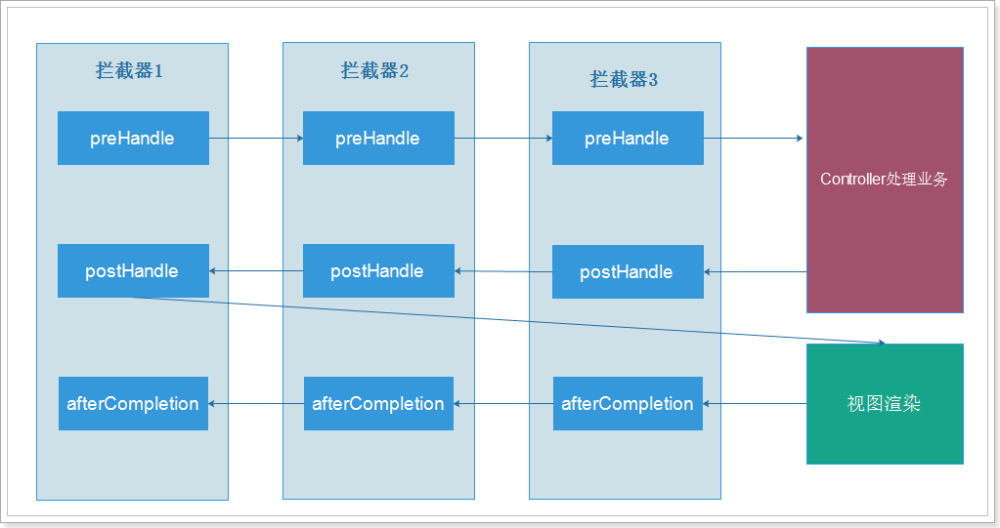
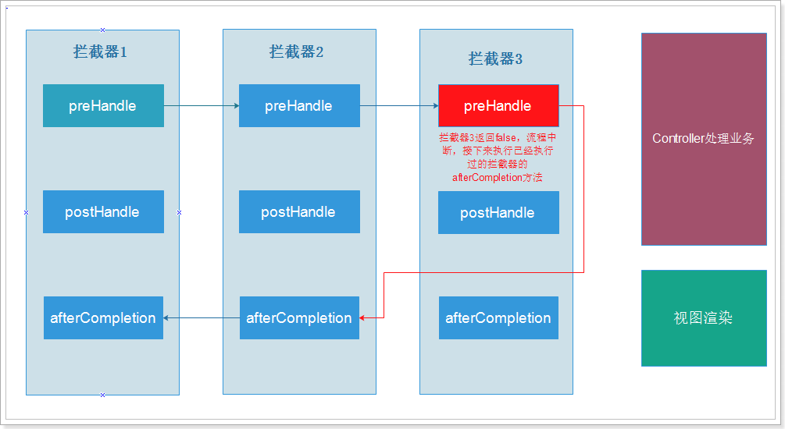

# SpringMVC

- [1. SpringMVC与MVC简介](#1)  
- [2. 配置文件](#2)  
- [3. 注解](#3)  
- [4. RequestMapping请求映射方式](#4)  
-   

## 1. SpringMVC与MVC简介
- MVC是一种架构模型, 本身没有什么功能, 只是让我们的项目结构更加合理, 流程控制更加清晰, 一般包含三个组件:
    - Model(模型): 数据模型, 用于提供要展示的数据. 一般包含数据和行为(也就是业务), 在JavaWEB中, 数据和业务往往是分离开的.
    - View(视图): 负责对模型数据进行展示, 例如我们看到的网页. 概念比较广泛, 可以是: html, jsp, excel, word, pdf, json, xml等.
    - Controller(控制器):接收用户请求, 委托给模型做处理, 处理完毕返回数据, 再交给视图做渲染, 相当于调度员工作.
- Spring Web MVC是一种基于Java的,实现了Web MVC设计模式的轻量级Web框架, 使用了MVC架构模式的思想, 将web层进行职责解耦, 采用了松散耦合可插拔组件结构, 比其它MVC框架更具扩展性和灵活性. 
- SpringMVC架构:structure

- 流程总结:
    - 1. 用户发起请求到`DispatcherServlet(前端控制器)`
    - 2.`DispatcherServlet`通过`HandlerMapping(处理映射器)`寻找用户要请求的Handler
    - 3.`HandlerMapping`返回执行链, 包含两部分内容:
        - 处理器对象: `Handler`
        - `HandlerInterceptor(拦截器)`的集合
    - 4. 前端控制器通过HandlerAdapter（处理器适配器）对Handler进行适配包装
    - 5. 调用包装后的Handler中的方法, 处理业务
    - 6. 处理业务完, 返回`ModelAndView`对象, 包含两部分: 
        - Model: 模型数据
        - View: 视图名称, 不是真正的视图
    - 7. `DispatcherServlet`获取处理得到的`ModelAndView`对象
    - 8. `DispatcherServlet`将视图名称交给`ViewResolver(视图解析器)`查找视图
    - 9. `ViewResolver`返回真正的视图对象给`DispatcherServlet`
    - 10. `DispatcherServlet`把Model(数据模型)交给视图对象进行渲染
    - 11. 返回渲染后的视图
    - 12. 将最终的视图返回用户, 产生响应

## 2. 配置文件
- web.xml中引入`DispatcherServlet`
----
    <servlet>
		<servlet-name>springmvc</servlet-name>
		<servlet-class>org.springframework.web.servlet.DispatcherServlet</servlet-class>
		<!-- 0：第一次被调用时创建； 1：Tomcat启动时就创建 -->
		<load-on-startup>1</load-on-startup>
	</servlet>
	
	<servlet-mapping>
		<servlet-name>springmvc</servlet-name>
		<!-- 
			/*		： 	匹配所有请求路径，不要用
			/		：	匹配除了.jsp以为的所有请求
			*.xxx	：	匹配以xxx为后缀的路径
		 -->
		<url-pattern>*.do</url-pattern>
	</servlet-mapping>

- SpringMVC配置文件, 其实就是类似于Spring的applicationContext.xml的一个配置文件(头一样), 配置SpringMVC需要使用到的bean, 例如HandlerMapping，HandlerAdapter等. `DispatcherServlet`默认是去寻找: WEB-INF/{servlet-name}-servlet.xml, 如果按上面的代码的话,应该找springmvc-servlet.xml.
    - HandlerMapping与HandlerAdapter有默认配置, 不配也可以, 默认配置见webmvc jar下的prg.springframework.web.servlet包下的DispatcherServlet.properties
----
    <?xml version="1.0" encoding="UTF-8"?>
    <beans xmlns="http://www.springframework.org/schema/beans"
        xmlns:xsi="http://www.w3.org/2001/XMLSchema-instance" xmlns:p="http://www.springframework.org/schema/p"
        xmlns:context="http://www.springframework.org/schema/context"
        xmlns:mvc="http://www.springframework.org/schema/mvc"
        xsi:schemaLocation="http://www.springframework.org/schema/beans http://www.springframework.org/schema/beans/spring-beans.xsd
            http://www.springframework.org/schema/mvc http://www.springframework.org/schema/mvc/spring-mvc-4.0.xsd
            http://www.springframework.org/schema/context http://www.springframework.org/schema/context/spring-context.xsd">
        
        <!-- 配置HandlerMapping -->
        <bean class="org.springframework.web.servlet.handler.BeanNameUrlHandlerMapping"/>
        <!-- 配置HandlerAdapter -->
        <bean class="org.springframework.web.servlet.mvc.SimpleControllerHandlerAdapter"/>
        
        <!--由于上面配置的是BeanNameUrlHandlerMapping,所以这儿一定要有name属性,HandlerMapping才能找到-->
        <bean name="/hello.do" class="xl.idea.springmvc.controller.HelloHandler"/>

        <!-- 配置视图解析器 ,会去找项目内部的静态资源作为视图，默认的路径是：prefix + 视图名称 + suffix
            Example: prefix="/WEB-INF/jsp/", suffix=".jsp", viewname="test" -> "/WEB-INF/jsp/test.jsp" 
        -->
        <bean class="org.springframework.web.servlet.view.InternalResourceViewResolver">
            <property name="prefix" value="/WEB-INF/views/" />
            <property name="suffix" value=".jsp" />
        </bean>
    </beans>

    <!--class文件:-->
    public class HelloHandler implements Controller {
        public ModelAndView handleRequest(HttpServletRequest request, HttpServletResponse response) throws Exception {
            //创建一个模型和视图对象
            ModelAndView mv = new ModelAndView("hello");
            //也可以通过set方法设置视图名称
            //mv.setViewName("hello");
            //添加模型数据,在SpringMVC中,Model是一个类似Map结构的容器,以键值对形式存储数据
            mv.addObject("message","这是我的第一个SpringMVC程序");
            return mv;
        }
    }

## 3. 注解
- 在Spring2.5以后, 就引入了注解方式的控制器定义方式, 并且在Spring3.0以后引入了更多非常强大的注解帮我们进行参数注入. 
- 在web.xml中
----
    <!--由于上面配置的是BeanNameUrlHandlerMapping,所以这儿一定要有name属性,HandlerMapping才能找到-->
    <bean name="/hello.do" class="xl.idea.springmvc.controller.HelloHandler"/>

    <!--不再配置Controller的Bean了, 直接配置包扫描-->
    <context:component-scan base-package="xl.idea.springmvc"/>

    <!--由于注解默认配置的HandlerMapping和HandlerAdapter已过时,所以应重新设置这两个bean-->
    <!--<bean class="org.springframework.web.servlet.mvc.method.annotation.RequestMappingHandlerAdapter"/>
    <bean class="org.springframework.web.servlet.mvc.method.annotation.RequestMappingHandlerMapping"/>-->
    <!--如果开启了注解驱动,就不用配置HandlerMapping和HandlerAdapter了, 因为如果配置了注解驱动开关,那么注解驱动的类被加载后, 会自动加载这两个HandlerMapping和HandlerAdapter和其他几个,Mapping/Adapter-->
    <mvc:annotation-driven />

    <!--配置视图解析器
        这里是内部资源视图解析器,就是指向项目内的文件,需要指定suffix和prefix,则文件最终路径就是:
        prefix + 视图名称 + suffix
        这里采用的是字符串拼接,一定要注意/的问题.
    -->
    <bean class="org.springframework.web.servlet.view.InternalResourceViewResolver">
        <property name="prefix" value="/WEB-INF/views/"/>
        <property name="suffix" value=".jsp"/>
    </bean>

- Controller类
----
    //通过Controller注解表明这是一个控制器类
    @Controller
    //可写可不写,写了就要在访问路径中加上/TestController,这里配置的时候/可加可不加,如果不加会自动补全.
    @RequestMapping("TestController")
    public class TestController {

        //通过RequestMapping定义当前方法的映射路径,在浏览器中通过这个路径访问这个方法
        //http://localhost/show1.do
        @RequestMapping("show1")
        public ModelAndView show1(){
            ModelAndView mv = new ModelAndView("hello");
            mv.addObject("msg", "我的第一个SpringMVC程序");
            return mv;
        }
    }

- 注解驱动的最终配置方式就是: 
    - 1. 开启注解驱动
    - 2. 开启扫描包
    - 3. 配置内部资源解析器

## 4. RequestMapping请求映射方式
    //通过Controller注解表明这是一个控制器类
    @Controller
    //可写可不写,写了就要在访问路径中加上/TestController,这里配置的时候/可加可不加,如果不加会自动补全.
    @RequestMapping("TestController")
    public class TestController {

        //通过RequestMapping定义当前方法的映射路径,在浏览器中通过这个路径访问这个方法
        //http://localhost/show1.do
        @RequestMapping("show1")
        public ModelAndView show1(){
            ModelAndView mv = new ModelAndView("hello");
            mv.addObject("msg", "我的第一个SpringMVC程序");
            return mv;
        }

        //Ant风格路径映射
        /**
        * ?    匹配一个字符
        * *    匹配零个或多个字符
        * **   匹配零个或多个路径
        */
        @RequestMapping("/**/show2")
        public ModelAndView show2(){
            ModelAndView mv = new ModelAndView("hello");
            mv.addObject("msg", "Ant风格映射**");
            return mv;
        }

        //占位符映射
        @RequestMapping("show3/{id}")
        //可以通过@PathVariable注解获取路径占位符中的变量值,并且可以映射为String或数值类型
        public ModelAndView show3(@PathVariable("id") Long id){
            ModelAndView mv = new ModelAndView("hello");
            mv.addObject("msg", "占位符映射,id为:"+id);
            return mv;
        }

        //占位符映射,请求方式限定,可以写多个请求方式.
        @RequestMapping(value = "show4/{id}", method = RequestMethod.POST)
        //可以通过@PathVariable注解获取路径占位符中的变量值,并且可以映射为String或数值类型
        public ModelAndView show4(@PathVariable("id") Long id){
            ModelAndView mv = new ModelAndView("hello");
            mv.addObject("msg", "占位符映射,id为:"+id + "如果正确显示,则为POST请求方式");
            return mv;
        }

        //参数请求限定

        /**
        * 参数限定规则:
        * params = "id"    请求参数中必须包含id
        * params = "!id"    请求参数中不能包含id
        * params = "id!=1"    请求参数中必须包含id,但其值不能为1
        * params = {"id","name"}    请求参数中必须包含id和name
        */
        @RequestMapping(value = "show5",params = "id")
        //方法中可以通过@RequestParam方式获取请求参数
        public ModelAndView show5(Long id,String name){
            ModelAndView mv = new ModelAndView("hello");
        mv.addObject("msg", "请求成功!你输入的ID为:"+id+"name为:"+name);
            return mv;
        }
    }

## 4. 视图解析
- 视图就是展示给用户看的结果. 可以是很多形式, 例如: html, JSP, excel表单, Word文档, PDF文档, JSON数据, freemarker模板视图等等.
- 默认使用的InternalResourceViewResolver解析器, 支持JSP, 可以结合JSTL和EL来将数据展示到页面
- json视图需要引入依赖包,比如JackJson
----

        //使用JSP视图渲染模型数据
        @RequestMapping(value = "show7")
        public ModelAndView show7(){
            ModelAndView mv = new ModelAndView("user-list");
            //创建用户列表,用于显示页面
            /*ArrayList<User> users = new ArrayList<User>();
            for (int i = 0; i < 10; i++){
                User user = new User();
                user.setId((long)i);
                user.setAge(20+i);
                user.setName("张三"+i);
                user.setUsername("zhangsan"+i);
                users.add(user);
            }*/
            List<User> users = show8();//show8重复代码,这样写可以吗?
            mv.addObject("users",users);
            return mv;
        }

        // 返回JSON视图
        @RequestMapping(value = "show8")
        // 这里没有返回ModelAndView,而是通过ResponseBody注解声明,返回的是JSON视图
        // SpringMVC会自动把返回值,这儿是List<User>转换为JSON格式返回
        @ResponseBody
        public List<User> show8(){
            ArrayList<User> users = new ArrayList<User>();
            for (int i = 0; i < 10; i++){
                User user = new User();
                user.setId((long)i);
                user.setAge(20+i);
                user.setName("张三"+i);
                user.setUsername("zhangsan"+i);
                users.add(user);
            }
            return users;
        }

        // 直接返回视图名称
        @RequestMapping(value = "show9")
        // 可以直接在这儿写参数,SpringMVC会自动注入
        public String show9(Model model){
            model.addAttribute("msg","试试model好不好用......");

            // 如果只是访问页面,就不需要创建MiodelAndView对象,只是返回一个字符串就好
            // 这个字符串就会作为视图的名称,从而访问到对应的页面
            return "index";
        }

        /*重定向与转发*/

        //重定向
        @RequestMapping(value = "show10")
        public String show10(){
            // 返回值以redirect: 开头,就是重定向,但是后面必须跟上url路径而非视图名
            return "redirect:/TestController/show9.do";
        }
        //转发
        @RequestMapping(value = "show11")
        public String show11(){
            // 返回值以forward: 开头,就是转发,但是后面必须跟上url路径而非视图名
            return "forward:/TestController/show9.do";
        }

        //不返回视图
        @RequestMapping(value = "show12")
        @ResponseStatus(HttpStatus.OK)
        // 如果写了void, 代表不返回视图, 那么就需要加ResponseStatus, 返回一个状态码
        public void show12(){
            System.out.println("请求已收到");
        }

## 5. 请求参数绑定和获取

        @RequestMapping("show13")
        //添加在方法参数列表中的参数,都会被SpringMVC自动注入,我们只管使用就可以.
        public String show13(HttpServletRequest req, HttpServletResponse resp, HttpSession session){
            //使用request对象保存数据
            req.setAttribute("msg1", "我是request,我添加了一条数据:"+req);
            req.setAttribute("msg2", "我是response,我添加了一条数据:"+ resp);
            //session对象保存数据
            session.setAttribute("msg3", "我是session,添加了数据"+session);
            return "servlet-test";
        }

        //获取PathVariable参数
        @RequestMapping("show14/{age}/{name}")
        public ModelAndView show14(@PathVariable("age") Long age, @PathVariable("name") String name){
            ModelAndView mv = new ModelAndView("hello");
            mv.addObject("msg", "占位符映射,age: "+ age + ", name: "+name);
            return mv;
        }

        // 获取表单参数
        @RequestMapping("show15")
        @ResponseStatus(HttpStatus.OK)
        public void show15(@RequestParam("name") String name,
                        @RequestParam("age") Integer age,
                        @RequestParam("income") Double income,
                        @RequestParam("isMarried") Boolean isMarried,
                        @RequestParam("interests") String[] interests) {
            System.out.println("name： " + name);
            System.out.println("age： " + age);
            System.out.println("income： " + income);
            System.out.println("isMarried： " + isMarried);
            System.out.println("interests： " + Arrays.toString(interests));
        }

        //获取请求参数并封装为pojo对象
        @RequestMapping("show16")
        public ModelAndView show16(User user){
            ModelAndView mv = new ModelAndView("hello");
            mv.addObject("msg", "接收不同参数:user"+user);
            return mv;
        }

        /*@RequestParam扩展
        * @RequestParam参数:
        * 1. value: 参数名
        * 2. required: 是否必须, 默认为true
        * 3. defaultVaule: 默认参数值
        * */
        @RequestMapping("show17")
        public ModelAndView show17(@RequestParam(value = "name", required = false, defaultValue = "狗蛋") String name){
            ModelAndView mv = new ModelAndView("hello");
            mv.addObject("msg", "接收普通参数: "+name);
            return mv;
        }

        //获取cookie的值
        @RequestMapping("show18")
        public ModelAndView show18(@CookieValue("JSESSIONID") String jsessionid){
            ModelAndView mv = new ModelAndView("hello");
            mv.addObject("msg", "接收cookie值: "+jsessionid);
            return mv;
        }

        /*接收对象中的List集合的写法
        <form action="/TestController/show19.do" method="post">
            用户1：<input type="text" name="users[0].name"/> 
            用户2：<input type="text" name="users[1].name"/> 
            用户3：<input type="text" name="users[2].name"/> 
            <input type="submit">
        </form>
        *
        * 上面的表单相当于同时提交了3个用户,也就是用户的集合,需要定义一个对象,对象中定义一个List<User>属性.
        *
        * */
        //获取cookie的值
        @RequestMapping("show19")
        public ModelAndView show19(UserForm userForm){
            ModelAndView mv = new ModelAndView("hello");
            mv.addObject("msg", "接收对象参数: "+ userForm);
            return mv;
        }

        //接收json格式的请求,可以把json字符串转为pojo对象
        /*@ResponseBody是把返回值的POJO对象变为JSON字符串,称为序列化
        * @RequestBody是把接收到的JSON字符串变为POJO对象,称为反序列化
        * */
        @RequestMapping("show20")
        @ResponseStatus(HttpStatus.OK)
        public void show20(@RequestBody() User user){
            System.out.println("id: "+user.getId());
            System.out.println("name: "+user.getName());
            System.out.println("age: "+user.getAge());
        }

        /*
        * 可以接收JSON字符串数组
        * */
        @RequestMapping("show21")
        @ResponseStatus(HttpStatus.OK)
        public void show21(@RequestBody() List<User> users){
            for (User user : users) {
                System.out.println("id: "+user.getId());
                System.out.println("name: "+user.getName());
                System.out.println("age: "+user.getAge());
            }
        }

## 6. 文件上传
- 底层也是使用的Apache的Commons-fileupload
- 需要在配置文件中添加文件上传解析器
----
    <!-- 定义文件上传解析器 -->
    <bean id="multipartResolver" class="org.springframework.web.multipart.commons.CommonsMultipartResolver">
    <!-- 设定默认编码 -->
    <property name="defaultEncoding" value="UTF-8"></property>
    <!-- 设定文件上传的最大值5MB，5*1024*1024 -->
    <property name="maxUploadSize" value="5242880"></property>
    </bean>

- 编写cntroller控制器中的代码
----

    //文件上传
    @RequestMapping("show22")
    public ModelAndView show22(@RequestParam("file") MultipartFile file) throws Exception{
        ModelAndView mv = new ModelAndView("hello");
        if(file != null){
            //将上传得到的文件,转移到指定文件.
            file.transferTo(new File("D:/07_temp/"+file.getOriginalFilename()));
        }
        mv.addObject("msg", file.getOriginalFilename()+"上传成功!");
        return mv;
    }

## 7. 拦截器
- 拦截器正常执行流程

- 拦截器异常中断执行流程

- 拦截器的配置
----
    <!--配置自定义拦截器-->
    <mvc:interceptors>
        <!--方式一: 直接在这里配置<bean/>对所有Controller拦截-->
        <bean class="xl.idea.springmvc.Interceptor.Interceptor1"/>
        <!--方式二: 通过<mvc:interceptor/>来配置,同时可以指定要拦截的路径-->
        <mvc:interceptor>
            <!-- 指定要拦截的路径，这里可以写固定路径，也可以使用Ant风格通配符,/**代表就是任意层数任意路径了 -->
            <mvc:mapping path="/**"/>
            <bean class="xl.idea.springmvc.Interceptor.Interceptor2"/>
        </mvc:interceptor>
    </mvc:interceptors>

- 测试拦截器的编写
----
    public class Interceptor1 implements HandlerInterceptor {

        public boolean preHandle(HttpServletRequest request, HttpServletResponse response, Object handler)
                throws Exception {
            System.out.println("**********我是拦截器1的前置处理方法。");
            // 这里返回true，代表放行，如果是false，流程中断，不再执行后续的Controller中的方法了
            return true;
        }

        public void postHandle(HttpServletRequest request, HttpServletResponse response, Object handler,
                            ModelAndView modelAndView) throws Exception {
            System.out.println("**********我是拦截器1的后处理方法。我看到了View：" + modelAndView.getViewName());
        }

        public void afterCompletion(HttpServletRequest request, HttpServletResponse response, Object handler, Exception ex)
                throws Exception {
            System.out.println("**********我是拦截器1的完成后处理方法。");
        }
    }

- 拦截器总结
    - 拦截器的前置方法顺序执行, 如果返回true, 继. 返回false, 流程终止, 倒序执行前面所有返回true的拦截器的完成方法.
    - 拦截器的后置方法倒序执行, 在Controller执行结束后, 视图解析前执行.
    - 拦截器的完成后方法倒序执行, 在视图解析后执行. 无论前面是否出错或返回false, 已经执行过的拦截器的完成方法都会被执行, 类似于finally.

## 8. SringMVC与Struts的区别
- SpringMVC的入口是Servlet, Struts2的入口是Filter, 两者的实现机制不同.
- SpringMVC基于方法设计, 传递参数是通过方法形参, 其实现是单例模式(也可以改多例,默认单例), Struts2基于类设计, 传递参数是通过类的属性,只能是多例实现. 性能上SpringMVC更高一些
- 参数传递方面,Struts2是用类的属性接收的,也就是在多个方法间共享, 而SpringMVC基于方法, 多个方法间不能共享.

